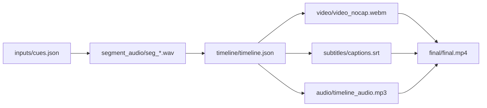

# presentation-skills

这是一个面向 **Codex CLI** 的 skills 集合，目标是把“做演示/写论文时反复踩坑的工作流”固化成可复盘、可协作、可复用的工具链。

目前包含 2 个 skill：

1. `ppt-complex-diagram-collab`：产出**出版级**、可编辑的 PPT 架构图/数据流图，并提供 connector 粘连校验。
2. `web-demo-video-synthesis`：把“网页 demo + 分段配音 + timeline 驱动录屏 + 字幕 + 合成”做成可审计的端到端流水线，输出高质量 MP4。

> 你问的“能不能在 README 里直接引用视频？”  
> GitHub README 一般可以**链接**到 `mp4`，但并不稳定支持在 README 里**内嵌播放**（HTML `<video>` 也常被限制）。最佳实践是：README 放一张截图/动图做缩略图 + 链接到 Release/外链视频。

## 安装（给 Codex CLI 用）

把这个仓库的链接复制给Codex, 让他自己装. 他会提醒你需要的步骤. 

依赖安装请参考各自的 `SKILL.md`（会包含必须的系统依赖与最小命令）。

## Repo 结构

- `ppt-complex-diagram-collab/`：PPT 可编辑复杂图协作 workflow
- `web-demo-video-synthesis/`：网页 demo → 配音/字幕 → timeline 录屏 → 合成视频 workflow
- `demos/`：可复现 demo（建议从这里端到端跑一遍再改）
- `old/`：历史/对照版本（非主线）

## 快速 CLI 参考

### 1) `ppt-complex-diagram-collab`

典型输出：
- 规划文档（mermaid/说明）+ 可编辑 `pptx` + 连线校验报告

连线校验（示例）：

```bash
python ppt-complex-diagram-collab/scripts/check_pptx_connectors.py \
  --pptx demos/ppt-complex-diagram-collab-stock-architecture/pptx/stock_architecture_complex_demo.pptx \
  --slides 1 \
  --forbid-prefix "Lane " \
  --min-connectors 0
```

Demo：`demos/ppt-complex-diagram-collab-stock-architecture/README.md`

### 2) `web-demo-video-synthesis`

核心产物是一个可协作 workspace（便于只重跑局部步骤）：



关键建议：
- 录屏阶段输出“无字幕母带”，最终合成阶段统一烧录字幕（可控、可复现）。
- 强烈建议对 `record_url` 加“正确失败”校验：`--fail-on-json true` + `--expect-selector`（避免端口冲突时录到别的服务/404 JSON）。

Demo（中文/英文各一套网页与文案）：`demos/web-demo-video-synthesis-financial-agent/README.md`

## Demos

- PPT 可编辑复杂图：`demos/ppt-complex-diagram-collab-stock-architecture/`
- 网页 demo 合成视频：`demos/web-demo-video-synthesis-financial-agent/`

注意：仓库默认忽略大媒体文件（`*.mp3` / `*.mp4`），避免推送体积失控（见 `.gitignore`）。

### `ppt-complex-diagram-collab` 展示

下图是该 skill 产出的“分层架构图风格”示例（可编辑 PPT）：

[](demos/ppt-complex-diagram-collab-stock-architecture/README.md)

这个 skill 主要解决：
- 复杂系统图从“讨论版（mermaid）”到“交付版（editable pptx）”的一致性。
- connector 粘连校验，避免拖动节点后连线飘散或粘错对象。
- 图集规划、视觉语法和边预算（edge budget）可复用。

### Web Demo Video Synthesis 预览

英文版截图（点击进入 demo 说明）：

[](demos/web-demo-video-synthesis-financial-agent/README.md)

视频 Demo（英文版）：
- Bilibili: https://www.bilibili.com/video/BV1j6NwzaEDZ/
