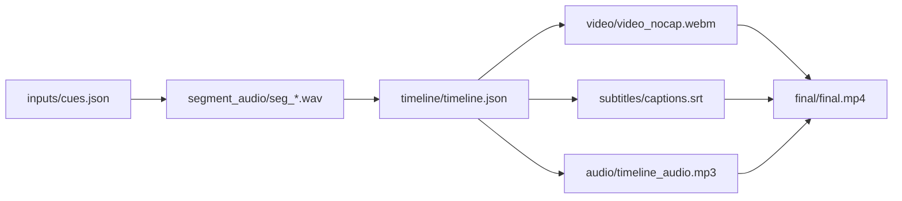

# presentation-skills

这是一个面向通用 agent CLI / assistant harness 的 skills 集合，目标是把“做演示/写论文时反复踩坑的工作流”固化成可复盘、可协作、可复用的工具链。

目前主线包含 2 个持续维护的 skill，另有 1 个归档 skill：

1. `ppt-polished-deck-collab`：产出**高质量**、可编辑、可预览、可校验的 PPT deck，覆盖 business、technical、research、education、operations 等主题，并内置 diagram、native chart、Python figure 和 icon 模块。
2. `web-demo-video-synthesis`：把“网页 demo + 分段配音 + timeline 驱动录屏 + 字幕 + 合成”做成可审计的端到端流水线，输出高质量 MP4。
3. `old/ppt-complex-diagram-collab`：归档的旧复杂图 skill，保留为历史对照和专项经验来源，不再作为主线更新入口。

> 你问的“能不能在 README 里直接引用视频？”  
> GitHub README 一般可以**链接**到 `mp4`，但并不稳定支持在 README 里**内嵌播放**（HTML `<video>` 也常被限制）。最佳实践是：README 放一张截图/动图做缩略图 + 链接到 Release/外链视频。

## 安装（给 agent / assistant 用）

把这个仓库的链接交给你的 agent 或 assistant，让它按宿主环境完成安装与接入。

依赖安装请参考各自的 `SKILL.md`（会包含必须的系统依赖与最小命令）。

## Repo 结构

- `ppt-polished-deck-collab/`：高质量 deck 主线 skill
- `web-demo-video-synthesis/`：网页 demo → 配音/字幕 → timeline 录屏 → 合成视频 workflow
- `demos/`：可复现 demo（建议从这里端到端跑一遍再改）
- `old/ppt-complex-diagram-collab/`：归档的旧复杂图 skill
- `old/`：历史/对照版本（非主线）

## 快速 CLI 参考

### 1) `ppt-polished-deck-collab`

典型输出：
- `brief.md` + `deck_narrative.md` + 派生 `slide_specs.yaml` + 可编辑 `pptx` + 逐页预览图 + 结构化验证结果

环境检查（示例）：

```bash
python ppt-polished-deck-collab/scripts/check_environment.py \
  --json-out temp/ppt_polished_env_check.json
```

预览导出（示例）：

```bash
python ppt-polished-deck-collab/scripts/export_pptx_previews.py \
  --pptx <path/to/deck.pptx> \
  --out-dir <path/to/ppt_preview> \
  --backend auto
```

复杂图 connector 校验（示例）：

```bash
python ppt-polished-deck-collab/scripts/check_pptx_connectors.py \
  --pptx <path/to/deck.pptx> \
  --slide 3 \
  --json-out <path/to/connector_report.json> \
  --min-connectors 1
```

集成测试样例：`temp/test_module_integration/`

### 2) `web-demo-video-synthesis`

核心产物是一个可协作 workspace（便于只重跑局部步骤）：



关键建议：
- 录屏阶段输出“无字幕母带”，最终合成阶段统一烧录字幕（可控、可复现）。
- 强烈建议对 `record_url` 加“正确失败”校验：`--fail-on-json true` + `--expect-selector`（避免端口冲突时录到别的服务/404 JSON）。

Demo（中文/英文各一套网页与文案）：`demos/web-demo-video-synthesis-financial-agent/README.md`

## Demos

- 归档复杂图 demo：`old/demos/ppt-complex-diagram-collab-stock-architecture/`
- 归档 polished deck demo：`old/demos/ppt-polished-deck-collab-ai-market-intelligence/`
- 网页 demo 合成视频：`demos/web-demo-video-synthesis-financial-agent/`

注意：仓库默认忽略大媒体文件（`*.mp3` / `*.mp4`），避免推送体积失控（见 `.gitignore`）。

### `ppt-polished-deck-collab` 与归档复杂图展示

下图是归档复杂图 skill 的“分层架构图风格”示例，它现在作为 `ppt-polished-deck-collab` 的 diagram module 经验来源保留：

[](old/demos/ppt-complex-diagram-collab-stock-architecture/README.md)

当前主线 `ppt-polished-deck-collab` 主要解决：
- 整套 deck 从 `brief.md`、`deck_narrative.md`、派生 `slide_specs.yaml` 到 editable `pptx`、preview、validation 的闭环。
- complex diagram、native Office chart、Python figure、icon 这些资产模块的统一接入。
- 页面原型、设计支持和技术支持的显式分层。

### Web Demo Video Synthesis 预览

英文版截图（点击进入 demo 说明）：

[](demos/web-demo-video-synthesis-financial-agent/README.md)

视频 Demo（英文版）：
- Bilibili: https://www.bilibili.com/video/BV1j6NwzaEDZ/
