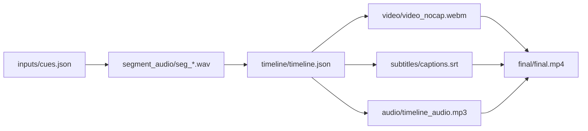

# presentation-skills

[中文版说明](README.zh.md)

`presentation-skills` is a repository of high-quality presentation skills for agent and assistant environments. The focus is not one-off output, but reusable workflows that turn presentation decks and product demos into reproducible, editable, and validated deliverables.

## Active Skills

- `ppt-polished-deck-collab`: a deck-level skill for planning, building, previewing, and validating polished editable PowerPoint decks across business, technical, research, education, product, and operations topics.
- `web-demo-video-synthesis`: a workflow for turning web demos into narrated, subtitled, and reproducible MP4 videos.

## Archived Skills

- `old/ppt-complex-diagram-collab`: archived as a historical reference for complex connector-backed diagrams and earlier PowerPoint connector workflows.

## Featured Demo

### Standard Wars Executive Deck

This is the current flagship demo for `ppt-polished-deck-collab`. It is a 12-slide, claim-led management deck about why superior technology often loses standards wars. The demo showcases the current positioning of the skill: deck-first narrative design, editable PPT generation, validation evidence, native Office charts, Python figures, native tables, connector-backed diagrams, and icon-system support.

[](demos/standard-wars-executive-deck/README.md)

[](demos/standard-wars-executive-deck/README.md)

Demo workspace:
- `demos/standard-wars-executive-deck/`

Key outputs:
- `demos/standard-wars-executive-deck/final/standard_wars_executive_deck.pptx`
- `demos/standard-wars-executive-deck/validation/structure/connector_report.json`
- `demos/standard-wars-executive-deck/build/rendered/ppt_preview/`

### Web Demo Video Synthesis

`web-demo-video-synthesis` is also a current first-class skill in this repository. It turns a browser demo into a narrated and subtitled MP4 through a reproducible pipeline built around cues, timeline generation, recording, audio mixing, subtitles, and final rendering.

[](demos/web-demo-video-synthesis-financial-agent/README.md)

Demo workspace:
- `demos/web-demo-video-synthesis-financial-agent/`

Key outputs:
- timeline-driven demo video workspace
- narrated audio segments and subtitles
- reproducible final MP4 pipeline

Public demo video:
- Bilibili: https://www.bilibili.com/video/BV1j6NwzaEDZ/

## Quick CLI Reference

### `ppt-polished-deck-collab`

Environment check:

```bash
python ppt-polished-deck-collab/scripts/check_environment.py \
  --json-out temp/ppt_polished_env_check.json
```

Build the featured demo:

```bash
python demos/standard-wars-executive-deck/build/build_deck.py
```

Validate the connector-backed page:

```bash
python ppt-polished-deck-collab/scripts/check_pptx_connectors.py \
  --pptx demos/standard-wars-executive-deck/build/pptx/standard_wars_executive_deck.pptx \
  --slide 3 \
  --json-out demos/standard-wars-executive-deck/validation/structure/connector_report.json \
  --min-connectors 7
```

Export slide previews:

```bash
python ppt-polished-deck-collab/scripts/export_pptx_previews.py \
  --pptx demos/standard-wars-executive-deck/build/pptx/standard_wars_executive_deck.pptx \
  --out-dir demos/standard-wars-executive-deck/build/rendered/ppt_preview \
  --backend auto \
  --json-out demos/standard-wars-executive-deck/validation/manifests/preview_manifest.json
```

### `web-demo-video-synthesis`

Core output pattern:



Demo:
- `demos/web-demo-video-synthesis-financial-agent/README.md`
- Public video: https://www.bilibili.com/video/BV1j6NwzaEDZ/

## Repository Layout

- `ppt-polished-deck-collab/`: active polished-deck skill
- `web-demo-video-synthesis/`: active web-demo-to-video skill
- `demos/`: registered demo workspaces
- `old/`: archived skills and historical demos
- `assets/`: root-level preview assets used by the repository README

## Demos

- Registered polished deck demo: `demos/standard-wars-executive-deck/`
- Registered web demo synthesis demo: `demos/web-demo-video-synthesis-financial-agent/`
- Archived complex diagram demo: `old/demos/ppt-complex-diagram-collab-stock-architecture/`
- Archived polished deck demo: `old/demos/ppt-polished-deck-collab-ai-market-intelligence/`
