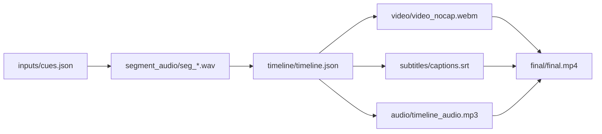

# presentation-skills

[中文版说明](README.zh.md)

`presentation-skills` is an open-source repository of high-quality, commercial-grade presentation tools for agent and assistant environments. The goal is not one-off output. The goal is reusable workflows that consistently produce polished, editable, validated decks and videos that are close to real business delivery standards.

These skills were not produced in one pass. They were iterated through many real runs, repeated failure analysis, output review, and workflow rewrites. A large amount of paid model tokens was spent to make the workflows, validation gates, and deliverables actually hold up in practice.

## Recent Updates

- `2026-04-22` `ppt-polished-deck-collab` now supports automatic quality gates for mobile-open risk, text overflow, object occlusion, and preview-layer layout failures, which materially reduces manual cleanup before delivery.
- `2026-04-22` `ppt-polished-deck-collab` also tightened its template-first workflow, so reference template audit, editable deck build, validation, preview export, and final review happen in a fixed order.

## What This Repo Provides

### `ppt-polished-deck-collab`

`ppt-polished-deck-collab` produces editable, high-quality, highly automated PowerPoint decks for both business and academic use. It can build a new deck from scratch, work from a user-provided template, inherit a user’s existing slide master and layouts, and modify an existing `pptx` while preserving editability.

It is designed for strategy decks, technical explainers, research talks, thesis defenses, product presentations, operations reviews, management decks, and other presentation-heavy workflows where the final artifact must still behave like a real PowerPoint file.

### `web-demo-video-synthesis`

`web-demo-video-synthesis` produces narrated, subtitled, publishable videos in a highly automated way. It can turn articles, posts, product walkthroughs, web demos, and technical explanations into videos suitable for platforms such as TikTok, Xiaohongshu, and Bilibili.

It is designed for technical introductions, business demos, product explainers, marketing-style walkthroughs, and other short-form or medium-form presentation videos where reproducibility and iteration speed matter.

## Skill Details

### `ppt-polished-deck-collab`

This is the flagship deck-making skill in the repository. It is a deck-level workflow rather than a page toy. It plans the narrative, generates editable `pptx`, exports previews, validates structure, and produces evidence bundles for review and handoff.

Core capabilities:
- Deck-first narrative planning with `brief.md`, `deck_narrative.md`, and derived `slide_specs.yaml`
- Editable PowerPoint generation with `python-pptx`
- Support for user-provided templates, slide masters, layouts, and existing `pptx` modification
- Native Office charts, Python figures, native tables, connector-backed diagrams, and icon accents
- Template audit plus three-stage quality gates: `package_preflight`, `structure_precheck`, and `render_review`
- Validation bundles, preview exports, and evidence-driven final delivery

Typical technical stack:
- `python-pptx` for editable PowerPoint objects
- PowerPoint or LibreOffice preview export
- Connector validation via `pptx XML`
- Structure-level and render-level quality gates
- Optional Python figure generation via `matplotlib` / `seaborn` / `pandas`

Typical workflow:
- Audit template if one is provided
- Lock brief and narrative
- Build editable deck
- Run package and structure gates
- Run module validation
- Export previews
- Run render review
- Finish with visual review and final handoff

Featured demo:
- `demos/standard-wars-executive-deck/`

Key outputs:
- `demos/standard-wars-executive-deck/final/standard_wars_executive_deck.pptx`
- `demos/standard-wars-executive-deck/validation/structure/connector_report.json`
- `demos/standard-wars-executive-deck/build/rendered/ppt_preview/`

[](demos/standard-wars-executive-deck/README.md)

[](demos/standard-wars-executive-deck/README.md)

### `web-demo-video-synthesis`

This is the flagship video-making skill in the repository. It turns a source narrative into a reproducible workspace for TTS, timing, subtitles, recording, mixing, and final rendering. The result is not a one-off export. The result is a workspace that can be reviewed, edited, rerun, and published.

Core capabilities:
- Turn cues, articles, or posts into timeline-driven demo videos
- Generate or integrate segment audio, subtitles, and final rendering
- Preserve a reproducible workspace for iteration and partial reruns
- Target platform-ready outputs for TikTok, Xiaohongshu, Bilibili, and similar channels

Typical technical stack:
- Timeline-driven workspace orchestration
- TTS and subtitle generation
- Screen recording and video compositing
- Final MP4 rendering with reproducible intermediate assets

Typical workflow:
- Prepare workspace and cues
- Generate segment audio
- Build timeline
- Record or synthesize visual track
- Generate subtitles
- Mix audio and video
- Export final MP4

Featured demo:
- `demos/web-demo-video-synthesis-financial-agent/`

Public demo video:
- Bilibili: https://www.bilibili.com/video/BV1j6NwzaEDZ/

[](demos/web-demo-video-synthesis-financial-agent/README.md)

## Quick CLI Reference

### `ppt-polished-deck-collab`

Environment check:

```bash
python ppt-polished-deck-collab/scripts/check_environment.py \
  --json-out temp/ppt_polished_env_check.json
```

Build the featured demo:

```bash
python demos/standard-wars-executive-deck/build/build_deck.py
```

Run deck-level package preflight:

```bash
python ppt-polished-deck-collab/scripts/check_pptx_package_preflight.py \
  --pptx demos/standard-wars-executive-deck/build/pptx/standard_wars_executive_deck.pptx \
  --workspace-dir demos/standard-wars-executive-deck \
  --fail-on error
```

Run structure precheck:

```bash
python ppt-polished-deck-collab/scripts/check_pptx_structure_precheck.py \
  --pptx demos/standard-wars-executive-deck/build/pptx/standard_wars_executive_deck.pptx \
  --workspace-dir demos/standard-wars-executive-deck \
  --inventory-out demos/standard-wars-executive-deck/validation/structure_precheck/shape_inventory.json \
  --fail-on error
```

Validate the connector-backed page:

```bash
python ppt-polished-deck-collab/scripts/check_pptx_connectors.py \
  --pptx demos/standard-wars-executive-deck/build/pptx/standard_wars_executive_deck.pptx \
  --slide 3 \
  --json-out demos/standard-wars-executive-deck/validation/structure/connector_report.json \
  --min-connectors 7
```

Export slide previews:

```bash
python ppt-polished-deck-collab/scripts/export_pptx_previews.py \
  --pptx demos/standard-wars-executive-deck/build/pptx/standard_wars_executive_deck.pptx \
  --out-dir demos/standard-wars-executive-deck/build/rendered/ppt_preview \
  --backend auto \
  --json-out demos/standard-wars-executive-deck/validation/manifests/preview_manifest.json
```

Run render review after preview export:

```bash
python ppt-polished-deck-collab/scripts/check_pptx_render_review.py \
  --pptx demos/standard-wars-executive-deck/build/pptx/standard_wars_executive_deck.pptx \
  --preview-dir demos/standard-wars-executive-deck/build/rendered/ppt_preview \
  --workspace-dir demos/standard-wars-executive-deck \
  --fail-on error
```

### `web-demo-video-synthesis`

Core output pattern:



Demo:
- `demos/web-demo-video-synthesis-financial-agent/README.md`
- Public video: https://www.bilibili.com/video/BV1j6NwzaEDZ/

## Repository Layout

- `ppt-polished-deck-collab/`: active polished-deck skill
- `web-demo-video-synthesis/`: active web-demo-to-video skill
- `demos/`: registered demo workspaces
- `old/`: archived skills and historical demos
- `assets/`: root-level preview assets used by the repository README

## Demos

- Registered polished deck demo: `demos/standard-wars-executive-deck/`
- Registered web demo synthesis demo: `demos/web-demo-video-synthesis-financial-agent/`
- Archived complex diagram demo: `old/demos/ppt-complex-diagram-collab-stock-architecture/`
- Archived polished deck demo: `old/demos/ppt-polished-deck-collab-ai-market-intelligence/`
