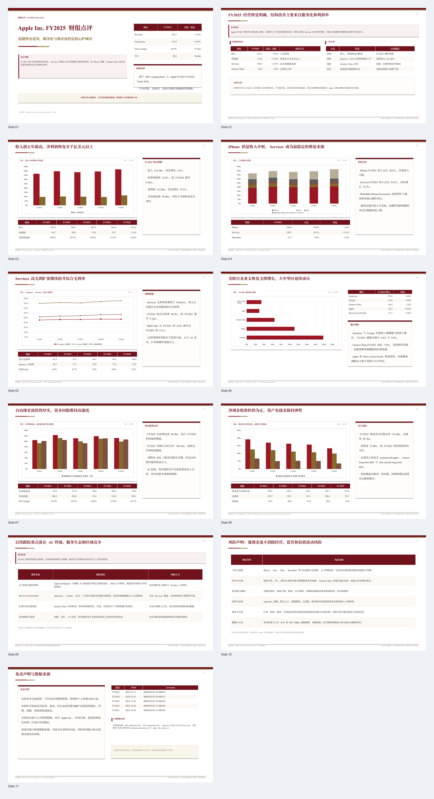
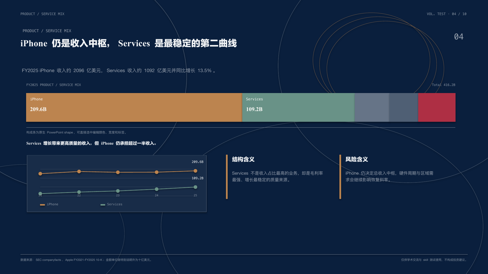
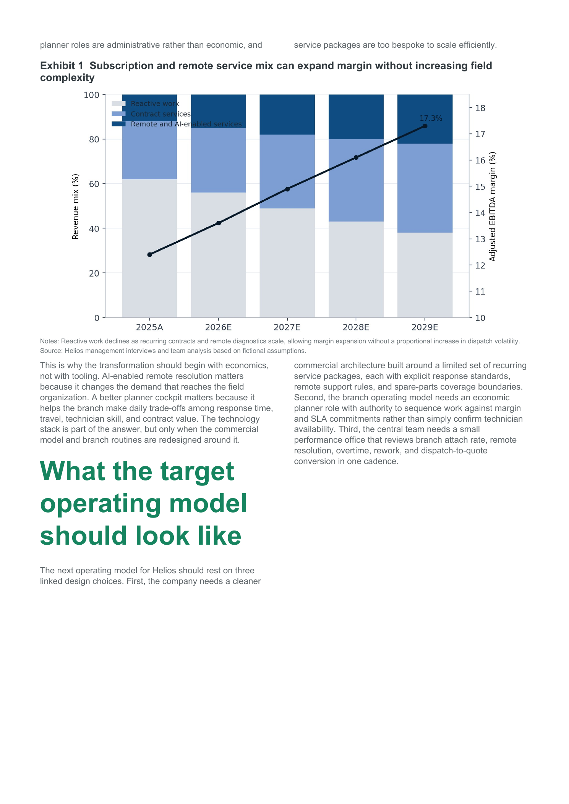

# presentation-skills

[中文版说明](README.zh.md)

**TL;DR.** `presentation-skills` is a collection of production-grade skills for making the artifacts people actually hand over: editable PowerPoint decks, formal Word documents, and publishable demo videos. The flagship skill is `ppt-polished-deck-collab`, which builds editable, validated PowerPoint decks across research reports, executive narratives, technical explainers, keynote-style talks, and template-driven business decks.

| Skill | Best For | Demo Signal |
| --- | --- | --- |
| `ppt-polished-deck-collab` | Editable research reports, executive decks, strategy narratives, technical explainers, keynote-style talks, template-driven business decks | Two Apple financial-analysis decks with the same source theme but very different presentation languages: formal research-report style and editorial-ink native PPTX style |
| `word-polished-doc-collab` | Formal reports, board attachments, research appendices, policy docs, consulting-style Word deliverables | Lightweight Chinese report plus refined English consulting report with preview and QA bundle |
| `web-demo-video-synthesis` | Product walkthroughs, narrated web demos, short-form explainers, publishable demo videos | End-to-end webpage, voiceover, subtitles, screen recording, and final MP4 pipeline |
| `xhs-markdown-card-collab` | Publishable Xiaohongshu image-card posts from Markdown, research/job posts, structured note-style social content | Demo bundles with PNG cards, preview HTML, metadata JSON, and theme variation under a locked typography contract |

`presentation-skills` is an open-source repository of high-quality, commercial-grade presentation tools for agent and assistant environments. The goal is reusable workflows that consistently produce polished, editable, validated deliverables close to real business delivery standards.

These skills were not produced in one pass. They were iterated through many real runs, repeated failure analysis, output review, and workflow rewrites. A large amount of paid model tokens was spent to make the workflows, validation gates, and deliverables actually hold up in practice.

## PowerPoint Decks

`ppt-polished-deck-collab` is designed to cover many deck shapes, not one fixed template:

| Scenario | What it can produce | Demo / Gallery / Evidence |
| --- | --- | --- |
| Formal financial report / research deck | Native Office charts, native tables, source notes, disclaimers, stable report layout | [Apple FY2025 financial report review](demos/apple-financial-report-review/README.md) |
| Editorial / keynote-style analysis | Large serif titles, visual rhythm, native shape charts, strong art direction without HTML screenshots | [Apple editorial ink native test](demos/apple-editorial-ink-native/README.md) |
| Strategy / executive narrative | Management questions, comparison matrices, decision logic, diagrams, narrative pacing | [Standard Wars executive deck](old/demos/standard-wars-executive-deck/README.md) |
| Technical explainer / architecture deck | Dataflow, system diagrams, connector-backed editable structures, validation reports | [PPT skill page](docs/ppt-polished-deck-collab.md) |
| Template-driven business deck | Template audit, master/layout evidence, branded rebuild when needed | [PPT skill page](docs/ppt-polished-deck-collab.md) |

Full PPT skill page: [docs/ppt-polished-deck-collab.md](docs/ppt-polished-deck-collab.md)

## PPT Gallery

| Same Apple topic, editorial presentation | Same Apple topic, formal research report |
| --- | --- |
|  |  |
| A native PPTX translation of guizang-style editorial ink: large type, dark/light rhythm, ghost numerals, shape charts, and no HTML screenshots. | A formal Chinese financial-report deck with native Office charts, native tables, stable report layout, source notes, and validation evidence. |

**Editorial page spotlight**

A single native PPTX page showing the editorial treatment: iPhone as the revenue center, Services as the stable second curve, stacked composition, embedded trend evidence, and a dark magazine-style page rhythm.

| Strategy narrative deck | Financial chart spotlight |
| --- | --- |
|  |  |
| Archived but still useful strategy narrative demo with diagrams, comparison matrices, and management questions. | A single evidence page showing how financial data, chart title, unit, source note, and key message are assembled. |

## Other Artifact Demos

## Prompt Example

This prompt style is intentionally specific about workspace placement, source data, reference style, disclosure language, and the `ppt-polished-deck-collab` skill route. The Apple demo turns that kind of request into a reproducible research-report workspace rather than a one-off presentation file.

## Recent Updates

- `2026-05-13` 🎨 Added the Apple editorial-ink native PPTX demo and the dedicated PPT skill showcase page.
- `2026-05-10` 📊 Made Apple FY2025 financial report review the flagship formal PPT demo.
- `2026-05-10` Added Standard Wars as an archived strategy-deck example.
- `2026-05-10` Added Chinese formal-report typography and financial-table defaults for PPT.
- `2026-05-05` Upgraded XHS fictional demos into rendered PNG bundles.
- `2026-05-04` Added `xhs-markdown-card-collab` for Markdown-to-image-card posts.
- `2026-04-30` Added two Word demo workspaces with preview and QA evidence.
- `2026-04-29` Added `word-polished-doc-collab` for formal DOCX workflows.
- `2026-04-22` 🛡️ Added PPT checks for file integrity, slide structure, and rendered previews.
- `2026-04-22` Tightened the PPT template route from template review to final delivery.

## What This Repo Provides

### `ppt-polished-deck-collab`

`ppt-polished-deck-collab` produces editable, high-quality, highly automated PowerPoint decks for both business and academic use. It can build a new deck from scratch, work from a user-provided template, inherit a user’s existing slide master and layouts, and modify an existing `pptx` while preserving editability.

It is designed for strategy decks, technical explainers, research talks, thesis defenses, product presentations, operations reviews, management decks, and other presentation-heavy workflows where the final artifact must still behave like a real PowerPoint file.

### `word-polished-doc-collab`

`word-polished-doc-collab` turns Markdown, DOCX, and Python-generated document assets into formal Word deliverables that can survive real review. It focuses on explicit Chinese-English font pairing, heading scale, line spacing, paragraph spacing, table and figure title placement, and delivery evidence instead of one-off DOCX export.

It is designed for contracts, policies, explanatory notes, research appendices, operating reports, board or investment committee attachments, and other Word-first workflows where the content source must remain maintainable after delivery.

### `web-demo-video-synthesis`

`web-demo-video-synthesis` produces narrated, subtitled, publishable videos in a highly automated way. It can turn articles, posts, product walkthroughs, web demos, and technical explanations into videos suitable for platforms such as TikTok, Xiaohongshu, and Bilibili.

It is designed for technical introductions, business demos, product explainers, marketing-style walkthroughs, and other short-form or medium-form presentation videos where reproducibility and iteration speed matter.

### `xhs-markdown-card-collab`

`xhs-markdown-card-collab` turns Markdown or lightly structured text into publishable Xiaohongshu image-card posts. It focuses on explicit cover metadata, stable Chinese typography, browser-based pagination, visual QA, and style variation without re-breaking proven type-size ranges.

It is designed for job posts, lab recruiting posts, research-note threads, structured commentary cards, product explainers, and other social content where the output must still read cleanly on a phone rather than merely “fit into a PNG”.

## Skill Details

### `ppt-polished-deck-collab`

`ppt-polished-deck-collab` starts by turning the user's story into a slide order, one clear message per page, and the evidence each page needs. It then generates a real editable `.pptx`, so the result can still be revised in PowerPoint instead of becoming a stack of screenshots.

Common tools:
- `python-pptx` for editable PowerPoint text, shapes, tables, and pages
- Native PowerPoint charts, `matplotlib` / `seaborn` / `pandas` figures, or image assets depending on the content
- PowerPoint or LibreOffice for slide-by-slide preview export
- Connector and layout checks when the deck includes flowcharts, architecture diagrams, or other editable structures

Typical workflow:
- Confirm the audience, use case, slide count, template, and style boundary
- Organize the slide outline, key message for each page, and required chart or visual assets
- Generate the editable PowerPoint, using a template or modifying an existing deck when needed
- Export slide previews and check text overflow, blurry charts, misplaced elements, and inconsistent page style
- Deliver the PowerPoint, PDF or previews, plus the review notes needed for handoff

Featured deck examples:
- Editorial native PPTX style demo: `demos/apple-editorial-ink-native/`
- Current research-report demo: `demos/apple-financial-report-review/`
- Archived strategy-deck demo: `old/demos/standard-wars-executive-deck/`

Key outputs:
- `demos/apple-editorial-ink-native/final/apple_editorial_ink_native_test.pptx`
- `demos/apple-editorial-ink-native/build/rendered/contact_sheet.png`
- `demos/apple-financial-report-review/final/apple_fy2025_financial_report_review.pptx`
- `demos/apple-financial-report-review/final/apple_fy2025_financial_report_review.pdf`
- `demos/apple-financial-report-review/build/rendered/contact_sheet.png`

### `word-polished-doc-collab`

`word-polished-doc-collab` starts by turning Markdown or an older Word draft into a stable structure of headings, body text, tables, images, and captions. It then generates a formal `.docx` with consistent fonts, line spacing, paragraph spacing, and caption placement, so the result can survive review and later editing.

Common tools:
- `python-docx` for generating and editing Word documents
- Direct OOXML handling when exact Chinese, Latin, and complex-script font slots matter
- Word or LibreOffice for PDF and page-preview export
- `matplotlib` / `pandas` when the document needs generated charts or tables

Typical workflow:
- Confirm the document purpose, source draft, and target formatting
- Clean up the structure of headings, body text, lists, tables, images, and captions
- Generate the `.docx`, using Chinese formal-report or English consulting-report typography when appropriate
- Export previews and check fonts, heading hierarchy, line spacing, tables, figures, headers, footers, and overall page layout
- Keep previews and review notes for formal reports so the document remains easy to revise and verify

Featured demos:
- `demos/word-lightweight-industrial-operations-brief/`
- `demos/word-refined-industrial-service-transformation/`

Key outputs:
- `demos/word-lightweight-industrial-operations-brief/out/industrial_operations_brief.docx`
- `demos/word-lightweight-industrial-operations-brief/out/preview/industrial_operations_brief.pdf`
- `demos/word-refined-industrial-service-transformation/build/docx/industrial_service_transformation.docx`
- `demos/word-refined-industrial-service-transformation/temp/qa/qa_report.md`

### `web-demo-video-synthesis`

`web-demo-video-synthesis` starts by splitting the narration into short segments, generating segment audio, and then using a timing table to drive web recording, subtitles, and final video composition. It keeps the audio, captions, recording, and final MP4 as separate outputs, so copy changes, subtitle changes, or re-recording can be done without rebuilding everything from scratch.

Common tools:
- TTS APIs or macOS `say` for segment audio
- Playwright for browser-controlled screen recording
- `ffmpeg` for combining video, audio, and subtitles
- Subtitle files and resolution settings for horizontal videos, vertical videos, and platform safe areas

Typical workflow:
- Prepare the narration and web demo
- Generate segment audio and confirm segment durations
- Record the web page according to the timing table
- Generate subtitles
- Mix audio, video, and subtitles into an MP4
- Check audio-video sync, subtitle position, image clarity, and whether key content is cropped

Featured demo:
- `demos/web-demo-video-synthesis-financial-agent/`

Public demo video:
- Bilibili: https://www.bilibili.com/video/BV1j6NwzaEDZ/

### `xhs-markdown-card-collab`

`xhs-markdown-card-collab` starts by cleaning up Markdown into phone-readable headings, lists, and emphasized points, then renders the result as vertical image cards in a real browser. It is designed for research notes, recruiting posts, product explainers, and structured commentary that should read like publishable Xiaohongshu cards instead of ordinary web screenshots.

Common tools:
- Markdown and YAML front matter for body content, cover title, organization, tags, and highlights
- HTML / CSS for real browser layout
- Playwright or similar browser automation for PNG export
- Theme colors, page frame, decorations, and content grouping for style variation

Typical workflow:
- Clean up the text structure while preserving the original meaning
- Define cover information and a mobile-first page size
- Render page-by-page PNG output and an HTML preview
- Check cover density, pagination, empty space, long text wrapping, orphan headings, and mobile readability

## Repository Layout

- `ppt-polished-deck-collab/`: active polished-deck skill
- `word-polished-doc-collab/`: active Word-document collaboration skill
- `web-demo-video-synthesis/`: active web-demo-to-video skill
- `xhs-markdown-card-collab/`: active Xiaohongshu Markdown-card skill
- `demos/`: registered demo workspaces
- `old/`: archived skills and historical demos
- `assets/`: root-level preview assets used by the repository README

## Demos

- Registered polished deck demo: `demos/apple-editorial-ink-native/`
- Registered polished deck demo: `demos/apple-financial-report-review/`
- Registered Word lightweight demo: `demos/word-lightweight-industrial-operations-brief/`
- Registered Word refined demo: `demos/word-refined-industrial-service-transformation/`
- Registered web demo synthesis demo: `demos/web-demo-video-synthesis-financial-agent/`
- Registered XHS recruiting-style demo: `demos/xhs-fictional-north-quay-lab-recruiting/`
- Registered XHS research-note demo: `demos/xhs-fictional-grid-storage-research-note/`
- Registered XHS product-explainer demo: `demos/xhs-fictional-orbitops-product-explainer/`
- Registered XHS weekly-brief demo: `demos/xhs-fictional-ridership-weekly-brief/`
- Archived complex diagram demo: `old/demos/ppt-complex-diagram-collab-stock-architecture/`
- Archived polished deck demo: `old/demos/ppt-polished-deck-collab-ai-market-intelligence/`
- Archived polished deck demo: `old/demos/standard-wars-executive-deck/`

## XHS Demo Set

The `xhs-markdown-card-collab` skill now includes four fully fictional demos under `demos/` with actual exported deliverables, so the workflow can be understood without relying on any real recruiting, research, or product copy:

- `demos/xhs-fictional-north-quay-lab-recruiting/`: institution recruiting / lab intake style, exported with `lumen`
- `demos/xhs-fictional-grid-storage-research-note/`: research-summary / framework-note style, exported with `ink`
- `demos/xhs-fictional-orbitops-product-explainer/`: product-explainer / capability-card style, exported with `clay`
- `demos/xhs-fictional-ridership-weekly-brief/`: weekly-brief / data-quick-take style, exported with `ink`
