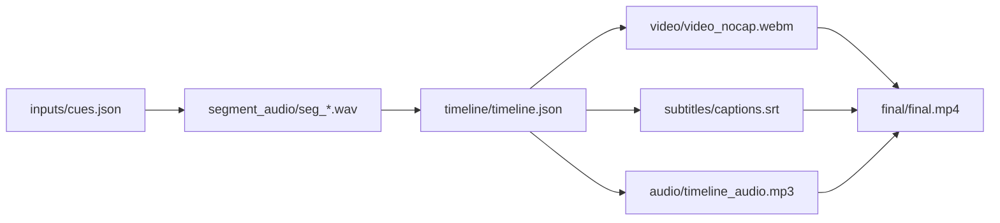

# presentation-skills

[English README](README.md)

`presentation-skills` 是一个面向 agent / assistant 环境的优质 presentation skills 仓库，重点不是一次性产出，而是把演示文稿和产品 demo 生产变成可复跑、可编辑、可验证的完整工作流。

## 当前主线技能

- `ppt-polished-deck-collab`：面向整套 deck 的高质量 PPT 技能，强调叙事规划、editable `pptx`、预览导出、结构校验和交付证据。
- `web-demo-video-synthesis`：把网页 demo 做成配音、字幕、时间线驱动、可复现 MP4 的工作流。

## 归档技能

- `old/ppt-complex-diagram-collab`：归档的旧复杂图技能，保留为历史经验来源。

## 主展示 Demo

### Standard Wars Executive Deck

这是 `ppt-polished-deck-collab` 当前的正式展示 demo。它是一套 12 页、以 claim 为主线的管理层 deck，主题是“为什么更好的技术经常输掉标准战”。这个 demo 集中展示了 skill 当前的能力定位：deck-first narrative、editable PPT、验证闭环、原生 Office chart、Python figure、原生表格、connector diagram 和 icon system。

[](demos/standard-wars-executive-deck/README.md)

[](demos/standard-wars-executive-deck/README.md)

Demo 工作空间：
- `demos/standard-wars-executive-deck/`

关键输出：
- `demos/standard-wars-executive-deck/final/standard_wars_executive_deck.pptx`
- `demos/standard-wars-executive-deck/validation/structure/connector_report.json`
- `demos/standard-wars-executive-deck/build/rendered/ppt_preview/`

### Web Demo Video Synthesis

`web-demo-video-synthesis` 也是这个仓库当前主打的优秀 skill。它把浏览器里的网页 demo 变成带配音、字幕和时间线驱动的可复现 MP4，主链路围绕 cues、timeline、录屏、音频混合、字幕和最终渲染展开。

[](demos/web-demo-video-synthesis-financial-agent/README.md)

Demo 工作空间：
- `demos/web-demo-video-synthesis-financial-agent/`

关键输出：
- timeline 驱动的 demo 视频工作空间
- 分段配音音频与字幕
- 可复现的最终 MP4 合成流水线

公开演示视频：
- Bilibili: https://www.bilibili.com/video/BV1j6NwzaEDZ/

## 快速 CLI 参考

### `ppt-polished-deck-collab`

环境检查：

```bash
python ppt-polished-deck-collab/scripts/check_environment.py \
  --json-out temp/ppt_polished_env_check.json
```

构建主展示 demo：

```bash
python demos/standard-wars-executive-deck/build/build_deck.py
```

校验 connector 页：

```bash
python ppt-polished-deck-collab/scripts/check_pptx_connectors.py \
  --pptx demos/standard-wars-executive-deck/build/pptx/standard_wars_executive_deck.pptx \
  --slide 3 \
  --json-out demos/standard-wars-executive-deck/validation/structure/connector_report.json \
  --min-connectors 7
```

导出逐页预览图：

```bash
python ppt-polished-deck-collab/scripts/export_pptx_previews.py \
  --pptx demos/standard-wars-executive-deck/build/pptx/standard_wars_executive_deck.pptx \
  --out-dir demos/standard-wars-executive-deck/build/rendered/ppt_preview \
  --backend auto \
  --json-out demos/standard-wars-executive-deck/validation/manifests/preview_manifest.json
```

### `web-demo-video-synthesis`

核心产物模式：



示例 demo：
- `demos/web-demo-video-synthesis-financial-agent/README.md`
- 公开视频：https://www.bilibili.com/video/BV1j6NwzaEDZ/

## 仓库结构

- `ppt-polished-deck-collab/`：当前主线 polished deck skill
- `web-demo-video-synthesis/`：当前主线 web demo 合成视频 skill
- `demos/`：正式注册的 demo 工作空间
- `old/`：归档技能和历史 demo
- `assets/`：根 README 使用的预览图资产

## Demos

- 正式 polished deck demo：`demos/standard-wars-executive-deck/`
- 正式 web demo synthesis demo：`demos/web-demo-video-synthesis-financial-agent/`
- 归档复杂图 demo：`old/demos/ppt-complex-diagram-collab-stock-architecture/`
- 归档 polished deck demo：`old/demos/ppt-polished-deck-collab-ai-market-intelligence/`
