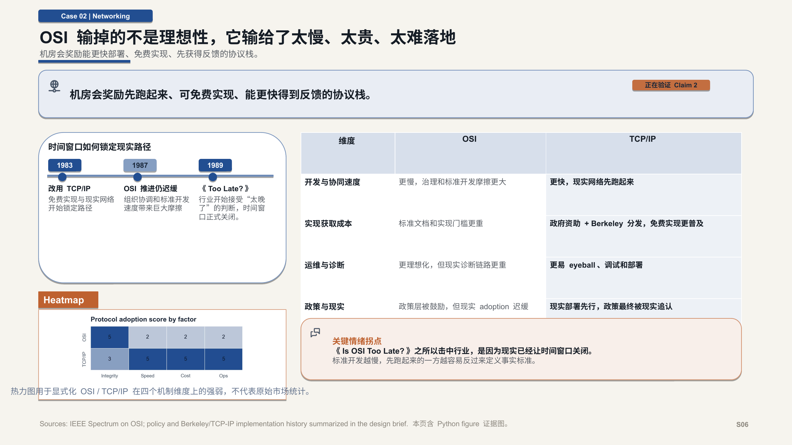
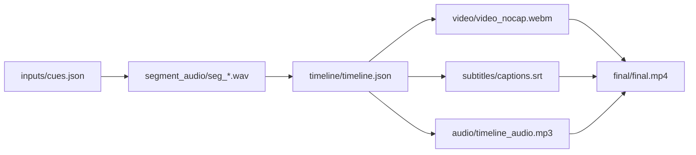

# presentation-skills

[English README](README.md)

`presentation-skills` 是一个面向 agent / assistant 环境的开源 presentation 工具仓库，目标是提供高质量、接近商业交付标准的工作流，而不是一次性的内容生成结果。

这里的重点不是“生成一页图”或“临时拼一版演示”，而是把演示文稿和产品 demo 的生产过程变成可复跑、可编辑、可验证、可交付的完整流水线。

这些 skills 不是一轮 prompt 产物。它们经过了大量真实任务中的反复迭代、失败分析、产物复核和工作流重写，并且为此消耗了大量真实付费 token，才把流程、验证链和最终输出收敛到当前这个水平。

## 最近更新

- `2026-04-22` `ppt-polished-deck-collab` 现在支持自动质量 gate，可以检查移动端打开风险、文本出格、对象遮挡和预览层排版失误，从而显著减少交付前的人类返工。
- `2026-04-22` `ppt-polished-deck-collab` 进一步收紧了 template-first 动线，现在模板审计、editable deck 构建、验证、预览导出和最终复核会按固定顺序执行。
- `2026-04-29` 新增 `word-polished-doc-collab`，把 Markdown、DOCX 与 Python 文档资产的往返协作抽象成独立 skill，并明确了中文宋体 / 楷体 / 黑体与英文 Times / Arial 的字体 profile、标题梯度、表题图题表注位置与质量 gate。

## 这个仓库提供什么

### `ppt-polished-deck-collab`

`ppt-polished-deck-collab` 用来生产可编辑、高质量、高度自动化的 PowerPoint deck，覆盖商业和学术两类用途。它既可以从零构建一整套 deck，也可以基于用户提供的模板工作，还可以继承用户已有 `pptx` 的母版和版式，并在保留可编辑性的前提下修改现有文件。

它适用于策略汇报、技术说明、研究汇报、论文答辩、产品演示、运营复盘、管理层 deck 等需要最终产物仍然表现为“真正 PowerPoint 文件”的场景。

### `word-polished-doc-collab`

`word-polished-doc-collab` 用来把 Markdown、DOCX 和 Python 生成的文档资产组织成正式、统一、可复跑的 Word 交付流程。它强调中英文字体组合、标题梯度、段前段后、行距、表题图题表注位置和交付前复核，而不是一次性导出一个“差不多能交”的 `.docx`。

它适用于合同、制度、说明文档、研究附录、业务报告、董事会或投委会附件等需要正式 Word 交付、且后续还要持续维护内容源的场景。

### `web-demo-video-synthesis`

`web-demo-video-synthesis` 用来高度自动化地生产带配音、带字幕、可直接发布的视频。它可以把文章、帖子、产品 walkthrough、网页 demo 和技术介绍转成适合 TikTok、小红书、Bilibili 等平台发布的视频内容。

它适用于技术介绍、商业 demo、产品解释、营销式演示和其他强调可复现、可迭代、产出速度快的视频生产场景。

## Skill 详情

### `ppt-polished-deck-collab`

这是仓库里当前主打的 deck 制作 skill。它不是一个“单页小工具”，而是一套 deck 级工作流。它负责规划叙事、生成 editable `pptx`、导出逐页预览、做结构验证，并为 review 和 handoff 产出证据 bundle。

核心能力：
- 基于 `brief.md`、`deck_narrative.md` 和派生 `slide_specs.yaml` 的 deck-first narrative 规划
- 基于 `python-pptx` 的 editable PowerPoint 生成
- 支持用户提供模板、继承 slide master / layout、以及修改现有 `pptx`
- 支持原生 Office chart、Python figure、原生表格、connector-backed diagram 和 icon accent
- 支持模板审计，以及 `package_preflight`、`structure_precheck`、`render_review` 三段式质量 gate
- 支持 validation bundle、预览导出和 evidence-driven final delivery

典型技术栈：
- 用 `python-pptx` 生成可编辑 PowerPoint 对象
- 用 PowerPoint 或 LibreOffice 导出高保真预览
- 用 `pptx XML` 做 connector 校验
- 用结构层和成图层质量 gate 做自动验证
- 用 `matplotlib` / `seaborn` / `pandas` 生成 Python figure

典型工作流：
- 如果有模板，先做模板审计
- 锁定 brief 和 narrative
- 构建 editable deck
- 执行 package 与 structure 两层质量 gate
- 执行模块级 validation
- 导出逐页预览
- 执行 render review
- 最后做 visual review 和 final handoff

主展示 demo：
- `demos/standard-wars-executive-deck/`

关键输出：
- `demos/standard-wars-executive-deck/final/standard_wars_executive_deck.pptx`
- `demos/standard-wars-executive-deck/validation/structure/connector_report.json`
- `demos/standard-wars-executive-deck/build/rendered/ppt_preview/`

[](demos/standard-wars-executive-deck/README.md)

[](demos/standard-wars-executive-deck/README.md)

### `word-polished-doc-collab`

这是仓库里新的 Word 文档协作 skill。它不是“导出一个 docx 的小脚本说明”，而是一套文档级工作流。它负责锁定 source of truth、规范 Markdown 语义、定义字体 profile、统一标题和正文节奏，并为表格、图片、Python 图和未来的 Office 原生图表提供稳定接入位。

核心能力：
- 围绕 `doc_workspace`、`canonical_markdown`、`style_profile` 和 `validation_bundle` 组织长期协作
- 支持 `docx -> markdown -> docx` 与 `markdown -> docx` 两类主路线
- 显式定义 `中文宋体 + 英文 Times New Roman` 的默认版式，以及 `楷体 + Times New Roman`、`黑体 + Arial` 的可选 profile
- 固化正文 `小四 12pt`、正文与标题 `1.5` 倍行距、段前段后 `0.5` 行、表格 `五号 / 小五`、表题图题表注位置
- 为 Python figure 和未来的 Office 原生 chart 预留清晰的接入路线
- 定义 source integrity、style contract、font slot integrity 和 visual review 四层质量 gate

关键文档：
- `word-polished-doc-collab/SKILL.md`
- `word-polished-doc-collab/references/principles.md`
- `word-polished-doc-collab/references/doc_workflow.md`
- `word-polished-doc-collab/references/typography_profiles.md`
- `word-polished-doc-collab/references/local_pipeline_case_study.md`

### `web-demo-video-synthesis`

这是仓库里当前主打的视频制作 skill。它会把源叙事转成一个可复现的 workspace，涵盖 TTS、时间轴、字幕、录制、混音和最终渲染。最终产物不是一次性导出，而是一套可以复核、可以编辑、可以重跑、可以发布的视频工作空间。

核心能力：
- 把 cues、文章或帖子转成 timeline-driven demo video
- 生成或接入分段音频、字幕和最终渲染结果
- 保留可复现 workspace，支持局部重跑和多轮迭代
- 面向 TikTok、小红书、Bilibili 等平台输出可发布视频

典型技术栈：
- 时间轴驱动的 workspace 编排
- TTS 与字幕生成
- 录屏与视频合成
- 带中间产物的可复现 MP4 渲染

典型工作流：
- 准备 workspace 和 cues
- 生成分段音频
- 构建 timeline
- 录制或合成视觉轨道
- 生成字幕
- 混合音视频
- 导出 final MP4

主展示 demo：
- `demos/web-demo-video-synthesis-financial-agent/`

公开视频：
- Bilibili: https://www.bilibili.com/video/BV1j6NwzaEDZ/

[](demos/web-demo-video-synthesis-financial-agent/README.md)

## 快速 CLI 参考

### `ppt-polished-deck-collab`

环境检查：

```bash
python ppt-polished-deck-collab/scripts/check_environment.py \
  --json-out temp/ppt_polished_env_check.json
```

构建主展示 demo：

```bash
python demos/standard-wars-executive-deck/build/build_deck.py
```

执行 deck 级 package preflight：

```bash
python ppt-polished-deck-collab/scripts/check_pptx_package_preflight.py \
  --pptx demos/standard-wars-executive-deck/build/pptx/standard_wars_executive_deck.pptx \
  --workspace-dir demos/standard-wars-executive-deck \
  --fail-on error
```

执行 structure precheck：

```bash
python ppt-polished-deck-collab/scripts/check_pptx_structure_precheck.py \
  --pptx demos/standard-wars-executive-deck/build/pptx/standard_wars_executive_deck.pptx \
  --workspace-dir demos/standard-wars-executive-deck \
  --inventory-out demos/standard-wars-executive-deck/validation/structure_precheck/shape_inventory.json \
  --fail-on error
```

校验 connector 页面：

```bash
python ppt-polished-deck-collab/scripts/check_pptx_connectors.py \
  --pptx demos/standard-wars-executive-deck/build/pptx/standard_wars_executive_deck.pptx \
  --slide 3 \
  --json-out demos/standard-wars-executive-deck/validation/structure/connector_report.json \
  --min-connectors 7
```

导出逐页预览：

```bash
python ppt-polished-deck-collab/scripts/export_pptx_previews.py \
  --pptx demos/standard-wars-executive-deck/build/pptx/standard_wars_executive_deck.pptx \
  --out-dir demos/standard-wars-executive-deck/build/rendered/ppt_preview \
  --backend auto \
  --json-out demos/standard-wars-executive-deck/validation/manifests/preview_manifest.json
```

预览导出后执行 render review：

```bash
python ppt-polished-deck-collab/scripts/check_pptx_render_review.py \
  --pptx demos/standard-wars-executive-deck/build/pptx/standard_wars_executive_deck.pptx \
  --preview-dir demos/standard-wars-executive-deck/build/rendered/ppt_preview \
  --workspace-dir demos/standard-wars-executive-deck \
  --fail-on error
```

### `word-polished-doc-collab`

这个 skill 当前以 **workflow + references** 为主，宿主项目可以按自己的实现提供脚本。一个已经被验证过的宿主命名方式是：

```bash
python scripts/doc_pipeline.py docx-to-md
python scripts/doc_pipeline.py md-to-docx
python scripts/doc_pipeline.py rebuild-all
```

建议先读：
- `word-polished-doc-collab/references/principles.md`
- `word-polished-doc-collab/references/doc_workflow.md`
- `word-polished-doc-collab/references/typography_profiles.md`
- `word-polished-doc-collab/references/local_pipeline_case_study.md`

### `web-demo-video-synthesis`

核心产物模式：



示例 demo：
- `demos/web-demo-video-synthesis-financial-agent/README.md`
- 公开视频：https://www.bilibili.com/video/BV1j6NwzaEDZ/

## 仓库结构

- `ppt-polished-deck-collab/`：当前主线 polished deck skill
- `word-polished-doc-collab/`：当前主线 Word 文档协作 skill
- `web-demo-video-synthesis/`：当前主线 web demo 视频合成 skill
- `demos/`：正式注册的 demo 工作空间
- `old/`：归档技能和历史 demo
- `assets/`：根 README 使用的预览图资产

## Demos

- 正式 polished deck demo：`demos/standard-wars-executive-deck/`
- 正式 web demo synthesis demo：`demos/web-demo-video-synthesis-financial-agent/`
- 归档复杂图 demo：`old/demos/ppt-complex-diagram-collab-stock-architecture/`
- 归档 polished deck demo：`old/demos/ppt-polished-deck-collab-ai-market-intelligence/`
