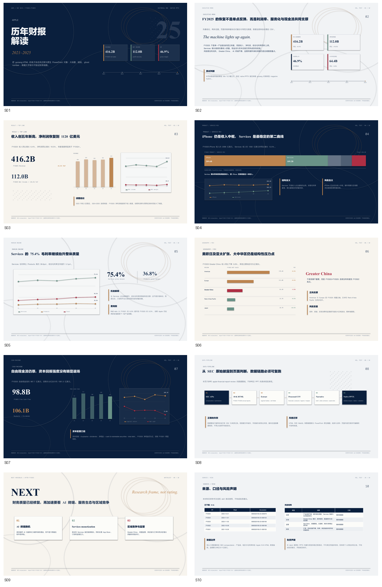
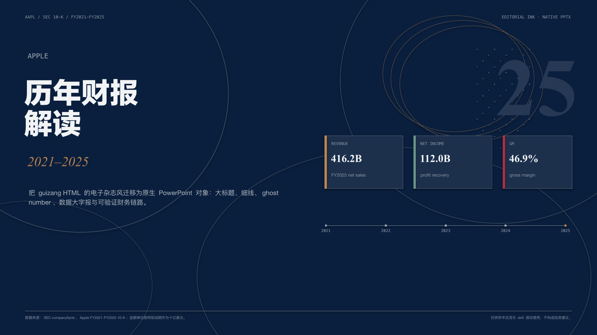
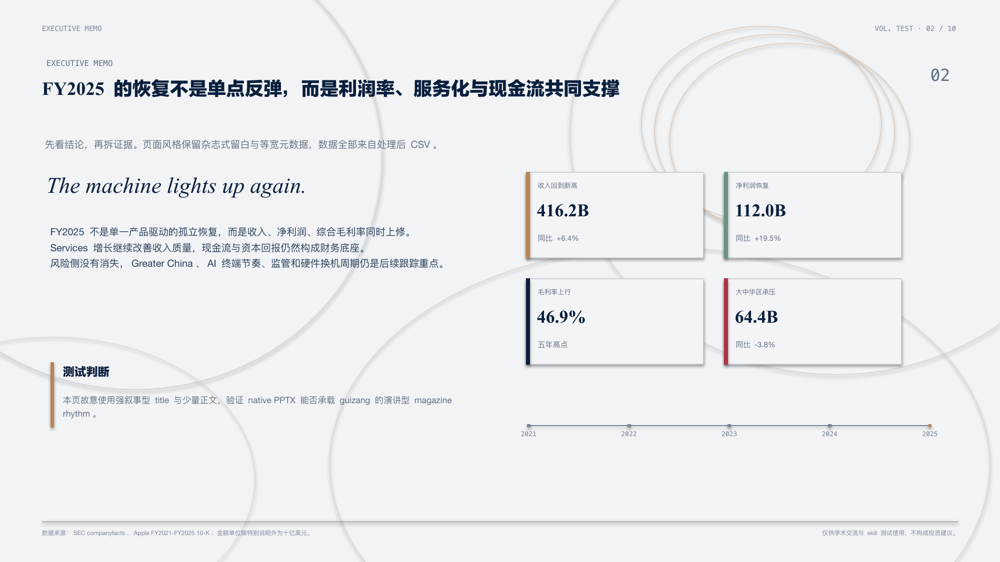
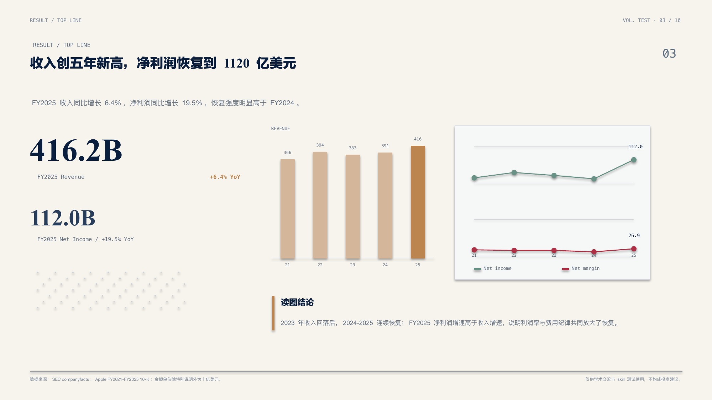
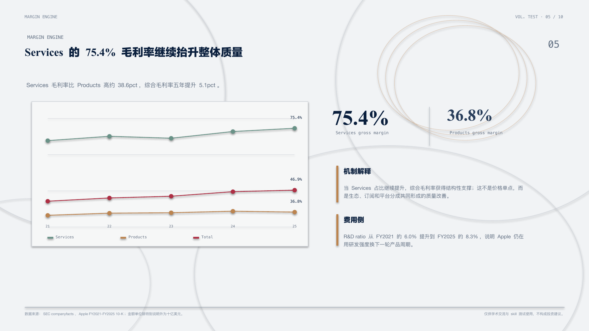
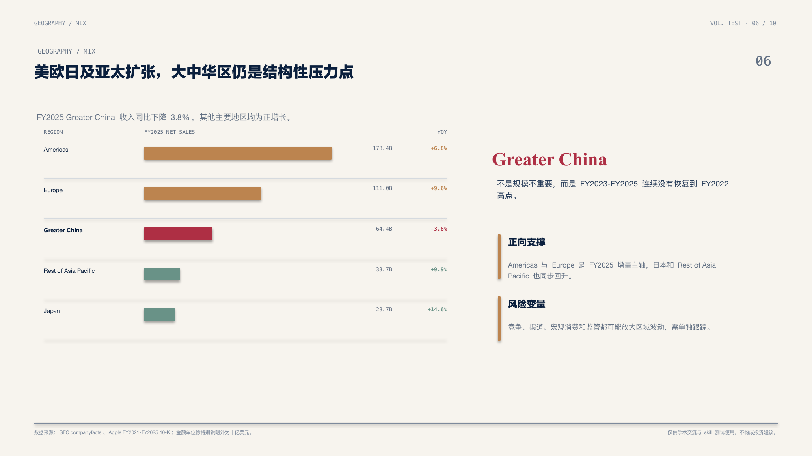
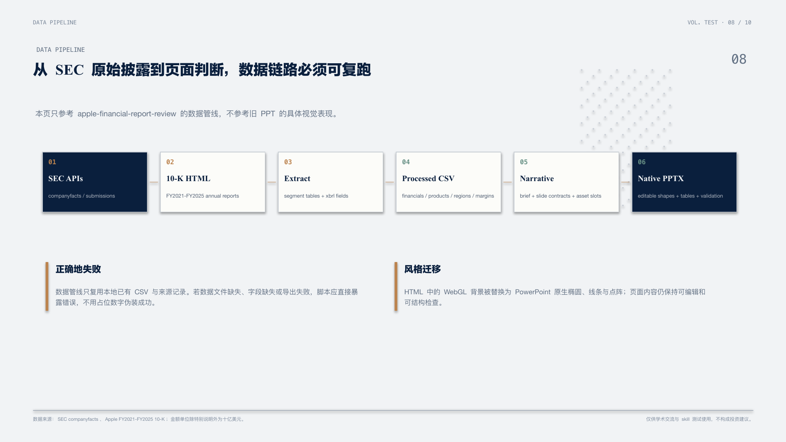
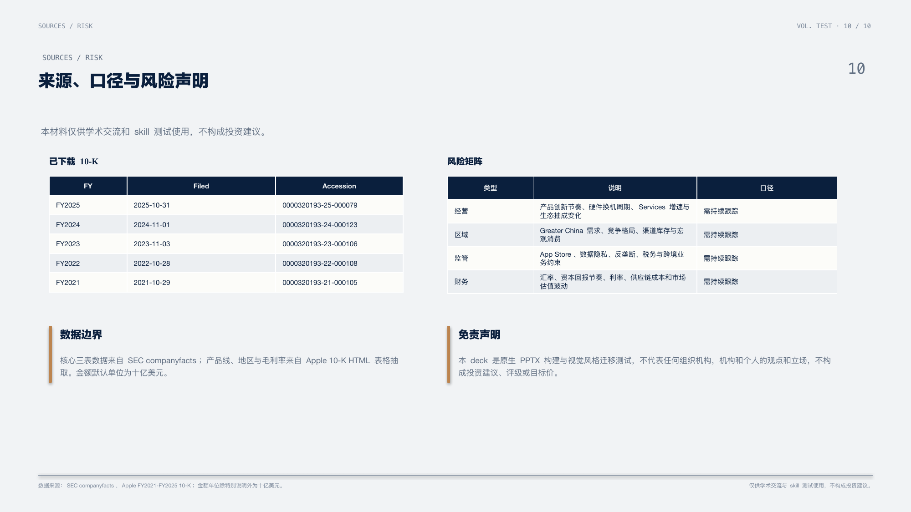

# Apple Editorial Ink Native PPTX Demo

**项目定位。** 这个 demo 展示 `ppt-polished-deck-collab` 如何把 guizang-ppt-skill 的 HTML “电子杂志 × 电子墨水”视觉语言迁移到可编辑原生 PowerPoint。它复用 Apple FY2021-FY2025 财报处理后数据，但不复用正式研报 demo 的具体 PPT 表现，重点测试一套更强艺术感、更适合分享和展示的 native PPTX 路线。

## 交付物
- 可编辑 PPT：`final/apple_editorial_ink_native_test.pptx`
- 逐页预览图：`build/rendered/ppt_preview/slide_001.png` 至 `slide_010.png`
- 预览 contact sheet：`build/rendered/contact_sheet.png`
- 构建脚本：`scripts/build_editorial_ink_pptx.py`
- Deck contract：`brief.md`
- 叙事与页面合同：`deck_narrative.md`、`build/generated/slide_specs.yaml`
- 数据底稿：`data/processed/*.csv`
- 验证记录：`validation/`

## 展示重点
- 同一 Apple 财报主题可以从正式研报版式切换成强视觉分享版式，说明 skill 不被单一模板或行业范式锁死。
- 页面没有使用 HTML 截图，主要视觉由 PowerPoint 原生文本框、矩形、椭圆、线条、表格和 shape chart 构成。
- 视觉迁移覆盖深浅页面节奏、大号衬线标题、等宽元数据、ghost number、细线、流体椭圆、点阵和数据大字报。
- 本 demo 不使用 Apple logo、机构 logo、投资评级、目标价或买卖建议。

## 页面预览



| S01 | S02 |
| --- | --- |
|  |  |

| S03 | S04 |
| --- | --- |
|  |  |

| S05 | S06 |
| --- | --- |
|  |  |

| S07 | S08 |
| --- | --- |
|  |  |

| S09 | S10 |
| --- | --- |
|  |  |

## 构建流程
以下命令默认在 `demos/apple-editorial-ink-native/` 目录下执行。

```bash
python ../../ppt-polished-deck-collab/scripts/derive_slide_specs_from_narrative.py \
  --narrative deck_narrative.md \
  --out-yaml build/generated/slide_specs.yaml \
  --json-out build/generated/slide_specs.json

python scripts/build_editorial_ink_pptx.py
```

## 验证命令
以下命令默认在 `presentation-skills/` 目录下执行。

```bash
python ppt-polished-deck-collab/scripts/lint_deck_assets.py \
  --workspace-dir demos/apple-editorial-ink-native \
  --check-contract

python ppt-polished-deck-collab/scripts/check_pptx_package_preflight.py \
  --pptx demos/apple-editorial-ink-native/final/apple_editorial_ink_native_test.pptx \
  --workspace-dir demos/apple-editorial-ink-native \
  --fail-on error

python ppt-polished-deck-collab/scripts/check_pptx_structure_precheck.py \
  --pptx demos/apple-editorial-ink-native/final/apple_editorial_ink_native_test.pptx \
  --workspace-dir demos/apple-editorial-ink-native \
  --inventory-out demos/apple-editorial-ink-native/validation/structure_precheck/shape_inventory.json \
  --fail-on error

python ppt-polished-deck-collab/scripts/export_pptx_previews.py \
  --pptx demos/apple-editorial-ink-native/final/apple_editorial_ink_native_test.pptx \
  --out-dir demos/apple-editorial-ink-native/build/rendered/ppt_preview \
  --backend libreoffice

python ppt-polished-deck-collab/scripts/check_pptx_render_review.py \
  --pptx demos/apple-editorial-ink-native/final/apple_editorial_ink_native_test.pptx \
  --preview-dir demos/apple-editorial-ink-native/build/rendered/ppt_preview \
  --workspace-dir demos/apple-editorial-ink-native \
  --fail-on error
```

## 验证结果
- `workspace lint`：通过；10 个 slide contracts 与 10 个 asset slots 已登记。
- `package_preflight`：通过；`error=0`、`warning=0`、`not_checked=0`，无 embedded object。
- `structure_precheck`：通过；`error=0`、`warning=0`、`not_checked=0`。
- `preview_export`：通过；LibreOffice + `pdftoppm` 导出 10 张 PNG，页数与 PPT 一致。
- `render_review`：通过；`error=0`、`warning=0`、`not_checked=0`。
- `visual_review`：通过；记录位于 `validation/visual/review_log.md`。

## 与正式研报 demo 的关系
- `demos/apple-financial-report-review/` 展示的是正式财报点评、原生 Office chart、原生表格和研报版心纪律。
- `demos/apple-editorial-ink-native/` 展示的是同一财报主题的艺术化表达、杂志节奏和 native PPTX 风格迁移。
- 两个 demo 放在一起，能说明 `ppt-polished-deck-collab` 的核心能力不是固定一种视觉模板，而是用同一套 deck workflow 和 validation chain 支撑不同传播场景。

## 强制声明
仅供学术交流与 skill 测试使用，不代表任何组织机构，机构和个人的观点和立场，不构成投资建议。
