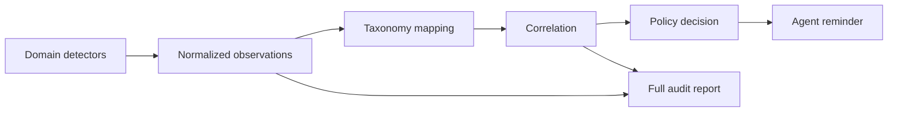

# Word / PPT 统一 Agent 提醒架构升级计划

**定位。** 本计划统一 `word-polished-doc-collab` 与 `ppt-polished-deck-collab` 给 agent 的 QC 提醒架构。底层 validator、Word 工作流和 PPT 工作流继续独立演进；本次只设计结果归一化、问题分类、阻断决策、压缩呈现和验收规则。

**目标。** Agent 应在 reminder 第一屏得知当前能否继续、必须先修什么、哪些事项只需关注、默认应改成什么，以及完整证据在哪里。

**详细依据。** 完整分析保留在 `docs/plans/统一Agent提醒架构升级计划.md`。实施以本短版的规范和验收标准为入口；出现边界问题时再查长版及当前仓库源码。

## 核心决策

**统一提醒协议。** Word 与 PPT 输出相同 schema、taxonomy、action 语义、排序规则和 token 预算。

**保留完整证据。** Full report 保存全部 observation 和 finding；agent reminder 只保留决策、分组计数、代表位置、修复动作和报告引用。

**分离问题与检测手段。** `problem_class` 表达发生了什么问题，`detector` 表达问题如何被发现。OOXML、几何估算、边缘检测、OCR 和人工 review 可以为同一问题提供证据。

**分离风险与流程动作。** `severity` 描述风险，`status` 描述是否完成检查，`agent_action` 决定工作流动作。三者不得互相推导。

**阻断绑定 milestone。** Hard/soft block 必须声明 `block_before` 和允许的修复动作，避免“blocked”冻结整个工作流。

**字号推荐直接给默认值。** 已知排版语言、role 和 active profile 时，提醒直接给出对应 token 值。最近 `0.5pt` 只用于 role 无法解析时的临时网格提示。

## 数据流



**Observation。** Detector 产生逐位置事实，包含 code、实际指标、结构化位置、检测方法和 evidence。

**Canonical finding。** Taxonomy 映射并保守合并同一 artifact、同一位置、同一问题的多路 observation。无法可靠对齐的 observation 保持独立。

**Resolved finding。** Policy 为 finding 增加 action、milestone、解除条件和例外规则。

**Agent reminder。** Renderer 按可执行修复分组，压缩重复文案和位置。

## QC 分类

每个 finding 使用三层稳定语义：

```yaml
domain: layout
family: text_fit
problem_class: layout.text_fit.bounds_overflow
```

一级 `domain` 固定为：

| Domain | 范围 |
| --- | --- |
| `artifact_integrity` | 文件包、关系、元数据完整性 |
| `source_integrity` | 输入、资产、manifest、来源完整性 |
| `content_structure` | 标题、顺序、caption、语言合同 |
| `content_quality` | 内容缺失、占位符、数据与文面一致性 |
| `typography` | 字体、字号、段落、表格文字 |
| `layout` | text fit、overlap、alignment、boundary、crop |
| `visual_object` | 图片、chart、diagram、可编辑性、渲染保真 |
| `accessibility` | 对比度、阅读顺序、alt text |
| `compliance` | 品牌、授权、隐私、法定文本 |
| `compatibility` | Office、移动端和目标平台兼容性 |
| `validation_coverage` | 必检 gate、未支持对象、证据新鲜度 |

**分类依据修复对象。** Gate、脚本和 detector method 不进入 domain。边缘检测属于 `detector.method=raster_edge_detection`；其发现的文字越界归 `layout.text_fit.bounds_overflow`。

**`not_checked` 是 status。** 已知 chart label collision 尚未检查时，problem class 仍为 `layout.overlap.chart_label_collision`，同时设置 `status=not_checked`。整个必检 gate 缺失时才归 `validation_coverage`。

**Catalog 是唯一分类来源。** 每个 problem class 必须定义 `domain / family / definition / excludes / message_template_id / fix_strategy_id / locator kinds`。新增 detector 优先映射已有 class。

**版本化治理。** Schema、taxonomy 和 policy 分别维护版本。Class 重命名或拆分时保留 alias 与 migration mapping，并提升 `taxonomy_version`。

## Finding 协议

Resolved finding 至少包含：

```yaml
schema_version: "1.0"
taxonomy_version: "1.0"
policy_version: "1.0"
code: font_size_role_drift
domain: typography
family: font_size
problem_class: typography.font_size.role_drift
severity: warning
status: detected
agent_action: soft_block
source: {skill: word-polished-doc-collab, gate: docx_qa, run_id: ...}
detector: {id: word.font_size.profile_check, layer: structure, method: ooxml_style_analysis, version: "1.0"}
artifact: {path: final/report.docx, fingerprint: sha256:...}
location: {kind: paragraph_run, paragraph: 12, run: 2, style: PSBody}
details: {...}
enforcement: {block_before: final, allowed_resolution_actions: [edit_source, rebuild, rerun]}
resolution: {...}
```

**Location 使用统一外壳。** PPT 可使用 slide/shape/raster region，Word 可使用 paragraph/run/table/cell，文件级问题可使用 package part。

**ID 分为两层。** `observation_id` 追踪 detector 证据；`finding_id` 追踪 correlation 后的问题。两者都绑定 artifact fingerprint，rebuild 后不得沿用旧 clear 或旧例外。

## Agent Action

| Action | 行为 | 默认解除方式 |
| --- | --- | --- |
| `hard_block` | 禁止跨越指定 milestone | 修复、重建、重跑并清除 finding |
| `soft_block` | 允许执行闭环动作，禁止跨越指定 milestone | 修复重跑、补 evidence，或按 policy 登记完整例外 |
| `advisory` | 允许继续并保持提醒 | 当前修订轮处理或 handoff 说明 |

**Soft block 必须可解除。** `resolution.conditions` 使用结构化规则，例如 `rerun_clear`、`evidence_exists`、`exception_recorded`。自然语言 `continue_when` 只负责展示。

**Human decision 是附加属性。** 需要人类接受例外时设置 `resolution.requires_human=true`，无需新增第四种 action。

**Decision 绑定目标阶段。** Reminder 使用 `hard_blocked / soft_blocked / proceed_with_obligations / proceed_with_advisories / clear`，并始终输出 `target_milestone`。

## 字号提醒规范

**排版语言来自文档合同。** `typography_language_profile` 优先读取 template audit、deck contract、Word meta 或 active profile。中文文档中的英文单词继续使用中文任务的字号 token，只切换 Latin font slot。

**推荐值解析顺序固定。** 依次读取 active template role token、active Word profile/preset 或 PPT theme token、同语言 skill fallback。语言或 role 无法解析时返回 `recommendation.status=unresolved`。

**模板例外必须登记。** 模板中的 `9.6pt` 只有已写入 token 且有理由时才合法。产物中出现任意小数不能反推为模板规范。

**Word 中文基线。** `cn_song_times` 正文 `12pt`，表格 `10.5pt`，密表 `9pt`。其他中文 profile 当前复用相同字号梯度，但 reminder 应显示实际 active profile id。

**Word 英文由 preset 决定。** `teal_consulting_report.body=9pt`，`red_private_equity_report.body=10pt`，`blue_editorial_article.body=10pt`。完整 role 值从 `word_skill_tools.py` registry 读取，禁止复制另一份常量表。

**PPT 中文 theme 基线。** `hero=40`、`section_title=30`、`page_title=24`、`subtitle=16`、`minor_title=14`、`body=12`、`label=10.5`、`caption=9`、`table=10.5pt`。QC 输出 active contract 的单一值，不输出设计区间。

**PPT 英文依赖 active contract。** 当前仓库允许英文或现代产品风格在合同明确选择时使用 `14pt` body，但没有通用英文标题、label、caption 梯度。缺少 active token/style fallback 时返回 unresolved。

推荐文案示例：

```yaml
message: 当前中文正文字号为 9.6pt；active `cn_song_times.body` 推荐 12pt。
suggested_fix: 如无模板、品牌或已登记的 profile 例外，直接改为 12pt。
```

**同位置只给一个主要修复。** Role drift、off-grid 和 fragmentation 同时命中时，reminder 优先显示 role/default 修复，并记录 `related_codes` 与 `suppressed_finding_count`。Full report 保留所有事实。

## 边缘检测接入

| 证据状态 | Problem class | Action |
| --- | --- | --- |
| 仅有边缘触墨，主体不明 | `layout.boundary.canvas_contact` | Soft block final，要求 OCR、对象映射或 visual review |
| OCR 指向文字，尚未映射原生对象 | `layout.text_fit.bounds_overflow` | Soft block final |
| 已映射文字对象并确认越界 | `layout.text_fit.bounds_overflow` | Hard block final |
| 合法 full-bleed 或 template chrome 已登记 | 保留 suppressed observation | 不进入 active reminder |

**Correlation 保守执行。** Artifact、page/slide、problem class 和 object id 必须一致；raster region 可按配置的 IoU 阈值对齐。多 detector 确认同一问题时 `occurrence_count=1`，`evidence_count` 反映证据数量。

**检测置信度不直接决定 action。** Policy 根据问题类型、证据成熟度和目标 milestone 决策。Detector 不自行定义退出码。

## Reminder 压缩规则

Agent reminder JSON 和 Markdown 使用同一 group 语义：

```text
agent_action + problem_class + fix_strategy_id
+ recommendation source/token/value
+ severity + status + resolution policy id
```

**实际字号不作为默认 group key。** 同为中文正文且都应改为 `12pt` 的 `9.6pt` 与 `11.3pt` 合为一组；`actual_value_counts` 显示代表分布。推荐值不同必须拆组。

**排序固定。** Action 顺序为 hard、soft、advisory；其后按 status、severity、domain、problem class、code 排序。Occurrence 数不影响优先级。

**位置受预算限制。** Hard/soft 每组最多 3 个代表位置，advisory 每组最多 1 个；所有省略必须显示 omitted count 和 full report ref。

**输出受预算限制。** 10 个以内 group 的 Markdown 不超过 6 KB；clear 不超过 1 KB；100 个同组 occurrence 相比 10 个时长度增长不超过 20%。

## 实施顺序

**协议与 fixtures。** 建立 schema、taxonomy catalog、policy catalog、detector catalog、correlation 规则和至少 21 个 golden fixtures。

**PPT adapter。** 将 `QualityIssue` 转为 observation，标注 detector 信息，经 taxonomy/correlation 生成 reminder；保留现有 full report 和退出码。

**Word adapter。** 将 lint `Issue`、QA `CheckResult` 和字号 advisory 转为 observation；字号改为先保留 occurrence 再聚合；保留 `passed_all_checks` 和退出码。

**工作流接入。** 两个 skill 的 agent 先读 reminder，根据 decision 行动，需要修复定位或审计时再读 full report。

**兼容收敛。** 完成消费方审计后再评估弃用 PPT `issue_type`、Word 专用 `advisories` 和 `--fail-on warning`。

## 验收标准

**协议一致。** Word/PPT reminder 通过同一 schema；所有现有 code 均有 taxonomy 和 policy；未知映射产生 `taxonomy_missing` 或 `policy_missing` soft block。

**阻断正确。** Action 与 severity 独立；所有 block 有 milestone 和解除条件；hard/soft 在目标态返回非零，advisory 不影响默认退出码。

**字号正确。** 中文 `cn_song_times.body=9.6pt` 推荐 `12pt`；英文 teal 推荐 `9pt`；英文 red 的 `11.3pt` 推荐 `10pt`；中文正文中的英文单词仍使用中文 profile；PPT 英文缺 token 时不得猜值。

**压缩正确。** 100 个同组问题只出现一次 message/fix；同位置 role drift 与 off-grid 只显示主要修复；不同推荐值分组；省略数量和完整报告引用可追溯。

**多路证据正确。** Geometry 与 edge/OCR 命中同一对象时合为一个 finding；无法对齐时保持独立；detected finding 取代同位置 not_checked reminder，并保留 `superseded_by` 证据链。

**边缘检测正确失败。** 主体不明只报告边缘触墨并 soft block final；确认文字越界 hard block final；有效 full-bleed/template exception 抑制 active reminder并保留审计记录。

**兼容性保持。** 第一阶段不改变现有 PPT gate、Word `passed_all_checks`、旧报告文件和默认退出码。

## 完成定义

- 两个 skill 能从现有 QC 输出生成同 schema、同 taxonomy 的 agent reminder。
- Agent 在第一屏得到 decision、默认修复值、解除条件和 full report 引用。
- 中文、英文和 active template/profile 的字号推荐通过 fixture 验收。
- Edge/OCR detector 接入后不产生平行问题大类或重复 occurrence。
- 分类、阻断、排序、token、证据完整性和兼容性测试全部通过。

## 仓库依据

- Word：`word-polished-doc-collab/SKILL.md`、`references/typography_profiles.md`、`references/preset_style_guides.md`、`scripts/word_skill_tools.py`
- PPT：`ppt-polished-deck-collab/SKILL.md`、`references/design/slide_design_system.md`、`references/core/schema_contract.md`、`scripts/init_deck_workspace.py`、`scripts/check_pptx_structure_precheck.py`、`scripts/check_pptx_render_review.py`、`scripts/ppt_quality_helpers.py`

## 实施完成记录

**完成状态。** 已建立随 skill 分发的 `scripts/agent_qc_reminders/` 本地 runtime，实现 schema、taxonomy、policy、correlation、grouping、Markdown/JSON renderer 和 sidecar 写出。Word 与 PPT 各自携带 runtime，不能依赖仓库根目录共享包。

**接入状态。** PPT `package_preflight`、`structure_precheck`、`render_review` 已在旧报告旁生成 `.agent_reminder.json/.md`；Word `lint_doc_markdown.py`、`run_docx_qa.py` 已生成同格式 reminder。旧 JSON/Markdown 报告、PPT `issue_type`、Word `advisories`、`passed_all_checks` 和默认退出码保留。

**字号状态。** Word QA 先保留 `font_size_observations`，再生成兼容旧报告的聚合 `advisories`；reminder 按 active profile/token 给出默认推荐值。PPT structure precheck 已补 `recommended_token/value` 字段，中文默认使用 skill fallback，英文缺 active token 时保持 unresolved。

**验证状态。** `temp/test_agent_qc_reminders/test_agent_qc_reminders.py` 覆盖协议、分类、阻断、字号、压缩、多证据、edge/OCR 和 sidecar 可审计输出；同时用现有 Word/PPT demo 跑通真实 CLI sidecar 生成。

**实测后补强。** 根据两个 subagent 的 repo-local 实测，新增 source/config 层字号 literal detector。Word build 前 lint 扫描 Markdown、meta、asset manifest 和 workspace scripts；PPT workspace lint 扫描 brief、narrative、slide specs 和 build/scripts 源文件。该 detector 保留 `Pt(9.6)`、`font_size: 11.3` 的原始证据，默认输出 advisory，并复用同一 taxonomy、policy、grouping 和 active token 推荐文案。

**阻断边界补清。** 字号 observation 默认不阻断；如果同一异常导致 Word `style_contract`、PPT `text_fit`、包结构或证据缺失等 finding，后者仍按 policy 独立 hard/soft block。Agent 的执行顺序是先处理 block，再处理或记录字号 advisory。

**交付路径补清。** Word 与 PPT workspace 的最终交付物统一放在根目录 `final/`。Word 新 workspace 默认 `output_docx=final/<doc>.docx`；PPT 新 workspace 默认 `final/*.pptx` 作为交付目录。`build/` 只放可重建工作稿、候选稿和中间物，`temp/` 与 `validation/` 只放测试、预览和证据。
