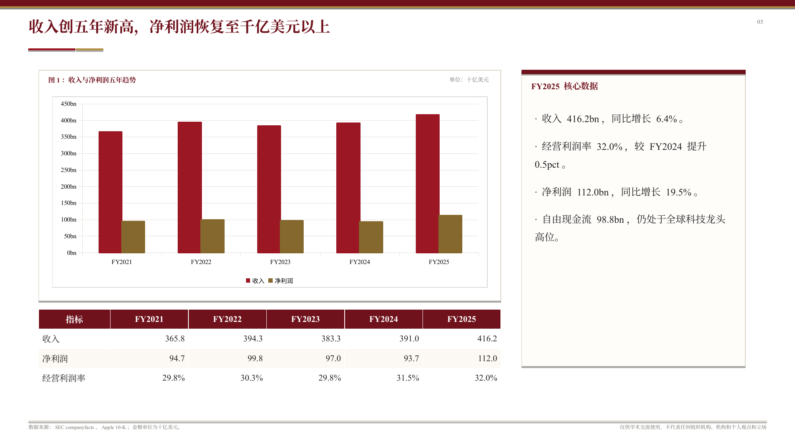

# ppt-polished-deck-collab

**页面定位。** 这页是 `presentation-skills` 的 PowerPoint skill 专页，用来展示 `ppt-polished-deck-collab` 的能力边界、典型场景、样例 gallery 和验证链路。根 README 负责快速转化，这页负责让读者看清楚“它不是只能做一种 PPT”。

## 核心能力

`ppt-polished-deck-collab` 是 deck 级 PowerPoint workflow，不是单页生成器。它把需求澄清、叙事规划、页面合同、资产路由、native PPTX 构建、预览导出和质量验证放在一条链路里执行。

它的核心目标是产出真实可交付的 PowerPoint 文件：文本、表格、图表、形状和必要 connector 尽量保持可编辑；构建之后必须有逐页预览图和 validation evidence。

## 它覆盖哪些 PPT 场景

| 场景 | 典型输出 | 关键能力 |
| --- | --- | --- |
| 正式财报 / 研报型 deck | 稳定版心、来源注、免责声明、原生图表和表格 | `office-chart-native`、`table-native`、财务口径、三段质量 gate |
| 艺术化分享 / keynote | 大标题、强节奏、深浅页面、杂志式图形语言 | `text-layout-native`、shape chart、native visual translation |
| 策略叙事 / executive deck | 管理层问题、对比矩阵、路线判断、结构图 | `board-memo`、`comparison-matrix`、`diagram-visual` |
| 技术说明 / 架构解释 | dataflow、系统层次、流程图、模块关系 | `diagram-connector`、connector validation、Mermaid 草稿层 |
| 模板继承 / 企业模板 | 继承母版、页眉页脚、固定字号和页族 | template audit、layout / master 取证、branded rebuild |
| 学术汇报 / 教学材料 | 研究问题、证据图、解释性结构页 | `research-note`、Python figure、引用与边界说明 |

## Gallery：同一主题，两种 PPT 表达

| Apple editorial ink native test | Apple formal financial report review |
| --- | --- |
|  |  |
| 强视觉分享型表达。复用 Apple 财报数据，把 guizang HTML 的“电子杂志 × 电子墨水”风格翻译成 native PPTX 对象。 | 正式中文财报点评。强调研报版心、原生 Office chart、原生表格、来源注、免责声明和验证证据。 |

这两个 demo 的价值在于对比：内容主题相近，但传播任务不同。一个偏舞台表达和视觉风格迁移，一个偏正式材料和数据审阅。它们使用同一套 deck workflow、workspace contract 和质量 gate，说明 skill 的主能力是“根据场景选择表达系统”，而不是套一个固定模板。

## Gallery：页面细节

| Editorial page | Formal report page |
| --- | --- |
|  |  |
| native shape chart、大号衬线数字、浅灰动态线和克制强调色。 | 原生 Office chart、图题、单位、来源注和研报版心。 |

| Strategy framework page | Data pipeline page |
| --- | --- |
|  |  |
| connector-backed framework route, suitable for editable executive diagrams. | 从 SEC API、10-K HTML、抽取脚本到 native PPTX 的可复跑数据链路。 |

## Gallery：更多 deck 类型

| Strategy narrative deck | Research chart page |
| --- | --- |
|  |  |
| 归档但仍有展示价值的策略叙事 demo，包含管理层问题、结构图、比较矩阵和决策逻辑。 | 财务证据页示例，展示 chart spotlight、图题、单位、来源和摘要判断如何组合。 |

## 工作流

**`brief.md` 固定全局任务。** 目标读者、使用场景、风格边界、模板约束、交付物和验证要求都写在这里。

**`deck_narrative.md` 固定叙事。** 页面问题、核心判断、阅读模式、页面原型和资产设想先在这里收敛。

**`slide_specs.yaml` 是机器入口。** 它从 narrative 派生，用来驱动构建脚本和 asset slots。

**asset slots 统一路由资产。** 图表、表格、diagram、icon、图片和生图都通过 slot 进入页面，避免 build 脚本临时发明页面逻辑。

## 资产路线

| Asset route | 适合情况 | 验证重点 |
| --- | --- | --- |
| `text-layout-native` | 封面、章节页、摘要页、强观点页 | 文本可编辑、标题层级、留白和对比度 |
| `office-chart-native` | 后续需要继续改数的趋势、比较、构成图 | chart 可编辑、workbook 嵌入风险、预览表现 |
| `python-figure-image` | 高密度研究图、热力图、复杂排序图 | DPI、比例、字体和图内文字可读性 |
| `table-native` | 财务表、明细表、附录表 | 表头居中、文本列左对齐、数值列右对齐、上下居中 |
| `diagram-connector` | 后续要拖动维护的架构图和流程图 | connector 真绑定和 XML 校验 |
| `diagram-visual` | 只服务解释的结构图、流程框架和机制图 | 主路径可读、连接关系清晰 |
| `icon-accent` | 页面节奏、轻语义提示和导航锚点 | icon 风格统一、对比度可读 |

## 质量 gate

完整 deck 默认要走三段式 gate：

- `package_preflight` 检查 PPTX 包结构、slide count、关系文件和移动端打开风险。
- `structure_precheck` 检查文本框 fit、对象遮挡和结构对象边界风险。
- `render_review` 在逐页 PNG 预览后检查成图层触边和扁平化图像风险。

这些 gate 的目标不是证明页面“审美完美”，而是让 deck 正确地失败。脚本没有报错不等于交付完成，最终仍然需要 contact sheet 或逐页 preview 的人工 visual review。

## 公开 demo

- `../demos/apple-editorial-ink-native/`：Apple editorial ink native test，展示强视觉风格迁移与 native PPTX 表达。
- `../demos/apple-financial-report-review/`：Apple FY2025 financial report review，展示正式财报点评、Office 原生图表和验证链路。
- `../old/demos/standard-wars-executive-deck/`：归档策略叙事 demo，展示 executive deck 与管理层问题表达。

## 入口文件

- Skill 主文件：`../ppt-polished-deck-collab/SKILL.md`
- 设计支持：`../ppt-polished-deck-collab/references/design/design_support.md`
- 页面视觉系统：`../ppt-polished-deck-collab/references/design/slide_design_system.md`
- 工作流：`../ppt-polished-deck-collab/references/workflow/deck_workflow.md`
- 质量 gate：`../ppt-polished-deck-collab/references/workflow/quality_gates.md`
- 技术路线：`../ppt-polished-deck-collab/references/workflow/build_routes.md`
