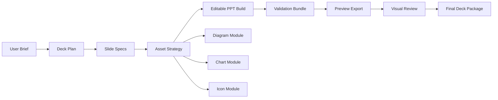

# 通用高质量PPT Skill设计计划

**本文定位。** 这份文档定义一个新的通用高质量 PPT skill 方案，用来承接“清楚表达、页面原型、可编辑 PPT 生成、结构校验、预览导出、视觉复核”这一整条链路。本文不直接替换现有 `ppt-complex-diagram-collab`，而是先给出一个更符合第一性原理的新 skill 设计，再决定后续迁移顺序。

**命名约定。** 本文当前以 `ppt-polished-deck-collab` 指代新 skill。这个名字强调它服务的是高质量 deck 交付标准，而不是把题材限制在 business，也不是把任务缩成单页复杂图。

## 为什么应该新建 skill

**核心交付物已经变了。** 现有 `ppt-complex-diagram-collab` 的中心对象是“复杂图包”，而当前真实演进方向已经变成“可讨论、可编辑、可校验、可预览、可复盘的高质量 deck”。当交付物从 `diagram pack` 变成 `deck package` 时，继续把旧 skill 往上硬扩，会让概念边界长期混乱。

**工作流主键已经变了。** 旧 skill 的工作流主键是 `figure planning + mermaid + connector check`。新方向的主键应当是 `deck plan + slide archetype + asset strategy + validation bundle`。前者是图驱动，后者是页面职责驱动。

**验证体系已经变了。** 复杂图时代最关键的验证是 connector 粘连。高质量 deck 时代的验证至少包含三层：结构正确、页面渲染正确、表达角色正确。connector check 仍然重要，但它应该降级为某一类页面的 specialized validation。

**第一性原理要求重新建模。** 一个好的通用 skill 应先定义业务对象、页面对象和验证对象，再决定哪些旧资产能复用。如果一开始就沿用“复杂图协作”命名，后续所有文档、脚本和 prompt 都会被历史包袱拖住。

## 新 skill 的目标

**目标定义。** `ppt-polished-deck-collab` 要帮助 Codex 与人类协作产出高质量、可编辑、可验证、可复盘的 PPT deck。它默认服务于汇报、评审、提案、研究结论表达、运营复盘、路线图、架构说明，也保留扩展到更多非 business 主题的能力。

**默认交付。** 一次完整交付的标准产物应包含 `deck_plan`、可编辑 `pptx`、结构化验证结果、逐页预览图，以及必要的源资产说明。不是每次都必须包含 mermaid，但每次都必须有可追溯的页面计划和验证证据。

**默认能力边界。** 新 skill 应覆盖标题页、定调页、决策页、讲解页、证据页、附录页，以及其中可能出现的流程图、架构图、原生图表、高 DPI 图表、图标和说明卡片。它不应承担“全自动生成完美视觉稿”的承诺，也不应承担“替代专业设计师做品牌定制”的目标。

## 新 skill 的核心定义

**最小业务对象是 deck。** deck 是一个围绕单一业务任务组织起来的页面集合，核心问题是“这套材料要说服谁、讲清什么、如何按页展开”，不是“某页上画几个框”。

**最小页面对象是 slide spec。** `slide_spec` 应至少定义页面任务、阅读方式、推荐原型、核心结论、资产类型、验证模式。页面任务和阅读方式是后续版式选择的先验，不是出图后的总结。

**最小验证对象是 validation bundle。** `validation_bundle` 应至少包含结构检查结果、预览导出结果、人工视觉复核记录。只有这样，skill 才能避免“脚本没报错就算完成”的虚假成功。

**最小复用对象是 archetype。** archetype 不是某个 demo 的长相，而是一类稳定的页面语法，例如 `decision logic`、`board memo`、`war-room board`、`research note`、`chart spotlight`、`comparison matrix`。

## 新旧 skill 的关系

**新 skill 是上层总控。** `ppt-polished-deck-collab` 负责 deck 级规划、页面原型路由、资产策略选择、统一验证闭环和最终交付。

**旧 skill 是已归档的专用模块。** `ppt-complex-diagram-collab` 现在已经归档到 `old/` 下。它最有壁垒的部分是 editable connector、复杂结构图构建经验和 `check_pptx_connectors.py` 这类结构校验能力，当前更合理的位置是作为 `diagram module` 的经验来源被新 skill 调用或吸收。

**`demo_draft` 是孵化与回归场。** `demo_draft` 现在更像 archetype bench、视觉语法实验区和工作流回归集。它不应直接等价于 skill 本体，但它应持续承担“共享规则变化后的全量回归”职责。

## 分层体系

**建议分成五层。** 这五层分别解决业务定义、执行路由、共享规则、专用模块和回归样本的问题。

| 层级 | 定位 | 典型内容 | 是否直接暴露给用户 |
| --- | --- | --- | --- |
| Principles | 统一业务逻辑与开发逻辑 | 核心对象、边界、失败原则、交付标准 | 是 |
| Skill Orchestration | 主工作流与资源路由 | `SKILL.md`、agent prompt、命令习惯 | 是 |
| Shared System | 通用规则与模板 | `deck_plan` 模板、页面原型、视觉系统、验证工作流 | 是 |
| Specialized Modules | 专项能力 | diagram、chart、icon、preview export、connector check | 部分 |
| Demo Bench | 样本与回归 | `demo_draft`、公开 demo、视觉回归集 | 否 |

**旧能力应按层吸收。** connector check、图示节点 helper、preview export、图表渲染和 archetype 经验都可以进入新 skill，但它们进入前必须先被归到正确层级，而不是继续平铺在一个目录里。

## Skill 包目录结构

**推荐结构。** 新 skill 的目录建议从第一天就按“文档先行、脚本后补”的方式组织。这里描述的是 skill 自身的包结构，不是某个具体 deck 项目的工作空间。

```text
ppt-polished-deck-collab/
  SKILL.md
  agents/
    openai.yaml
  references/
    principles.md
    deck_workflow.md
    technical_support.md
    design_support.md
    slide_design_system.md
    build_routes.md
    diagram_support.md
    office_chart_support.md
    python_figure_support.md
    icon_system.md
  scripts/
    check_environment.py
    export_pptx_previews.py
    check_pptx_connectors.py
    lint_deck_assets.py
    ppt_asset_helpers.py
    python_figure_helpers.py
  examples/
    ...
```

**`docs/` 的职责。** 仓库根目录 `docs/` 只放设计计划、迁移讨论、原则升级记录这类跨 skill 文档。真正给 skill 运行时消费的文档应进入 skill 自己的 `references/`。

## requirements 资料的规范写法

**先说结论。** skills 体系里没有一个单独强制的 `requirements` 协议文件。当前本地 `skill-creator` 和 `quick_validate.py` 真正校验的是 `SKILL.md` frontmatter，其中必需字段只有 `name` 和 `description`，可选字段主要是 `license`、`allowed-tools` 和 `metadata`。

**skill 的 requirements 应按职责拆开放。** 对新 skill，规范做法不是发明一个神奇总文件，而是把 requirements 分成三层：触发与主流程写在 `SKILL.md`，详细要求和依赖写在 `references/`，可机读的 UI / dependency 信息写在 `agents/openai.yaml`。

**建议把 requirements 和技术选型先收进 `references/technical_support.md`。** 这份文件先回答“有哪些技术模块、各自用什么 SDK 和验证方式、当前是 available / partial / planned 的什么状态”，再把更细的 backend 与平台差异下沉到 `references/build_routes.md`。

**环境状态不必单独存成 reference。** 更好的方式是用 `scripts/check_environment.py` 做可执行检查，让 agent 先看到当前机器能走哪些路线，再决定 backend。

**`agents/openai.yaml` 只写产品侧依赖。** 如果后续 skill 需要 MCP 或其他 harness 级依赖，可写进 `dependencies`。但操作系统工具、Python 包、品牌资产、模板文件这类内容不应塞进 `openai.yaml`，而应回到 `references/` 与 `assets/`。

**不要把 requirements 写死成单一路线。** 对新 skill，更规范的方式是写成“能力要求 + 可选技术路线矩阵”，例如 editable PPT 生成允许 `python-pptx` 直生和模板改写两类路线，预览导出允许 PowerPoint 链路和 LibreOffice 链路两类路线。

## Workspace 设计

**新 skill 必须以 workspace 为中心。** 旧复杂图 skill 更像“围绕某张图或某组图组织文件”。新高质量 deck skill 应以“围绕一次 deck 交付组织文件”为默认视角，让 brief、计划、内容、资产、构建结果、验证结果和最终交付各自落在稳定位置。

**workspace 应服务迭代，不服务一次性生成。** 最好的工作空间不是“每次跑一个新输出目录”，而是有一套稳定主路径，让人类和 Codex 能持续在同一个 deck 上改 brief、改页面、换图表、重建 PPT、重导预览、复核差异。

**workspace 应按资产生命周期分区。** deck 的信息流是 `brief -> plan -> content -> assets -> build -> validation -> final`，目录应直接反映这条链路，而不是按技术实现细节随意散落。

**workspace 不应默认 mermaid-first。** 对高质量 deck 而言，diagram 只是某类资产。新的工作空间应把 diagram、chart、icon、image、table 都当成平级资产类型，而不是让 `assets/*.mmd` 冒充全部源资产。

**推荐工作空间。** 对单个 deck 项目，建议使用下面这套结构。

```text
deck_workspace/
  brief/
    brief.md
    audience.md
    constraints.md
  plan/
    deck_plan.md
    slide_specs.yaml
    review_log.md
  content/
    narrative.md
    key_claims.md
    terminology.md
  data/
    raw/
    processed/
  assets/
    diagrams/
    charts/
    icons/
    images/
    tables/
  build/
    build_deck.py
    pptx/
    rendered/
      ppt_preview/
      charts/
      diagrams/
  validation/
    structure/
    visual/
    manifests/
  final/
    final_deck.pptx
    handoff.md
```

**`brief/` 负责任务源头。** 这里放原始需求、目标读者、场景约束、品牌或风格要求。这个区的职责是回答“为什么做这套 deck”和“哪些约束不能碰”。

**`plan/` 负责页面级主键。** `deck_plan.md` 和 `slide_specs.yaml` 是最重要的结构化输入。所有页面原型、资产选择、验证模式都应从这里出发，而不是由生成脚本隐式决定。

**`content/` 负责叙事稳定性。** deck 的核心是结论、论证链和术语一致性。把 narrative 和 key claims 单独落盘，可以避免“页面越画越多，但核心信息越来越漂”的常见问题。

**`assets/` 负责多模态源资产。** diagram、chart、icon、image、table 分目录管理，意味着新 skill 可以自然支持“有些页只用 chart，有些页只用 icon，有些页需要 diagram module”，不再把所有页面都拖进 diagram 工作流。

**`build/` 负责可重建产物。** 这里放生成脚本、当前 `pptx` 和中间渲染产物。`rendered/ppt_preview` 是视觉评审输入，`rendered/charts` 和 `rendered/diagrams` 是构建过程资产，不应混到 `final/`。

**`validation/` 负责证据。** 结构检查、视觉复核、清单和 manifest 都应集中落在这里。后续如果增加 slide-level lint、asset completeness check、icon family check，也应归到这个区。

**`final/` 负责对外交付。** 最终给用户或评审会使用的 deck、导出说明和 handoff 只放在这里，避免人类在一堆中间产物里找“哪份才是最新可用版本”。

**workspace 应只有一套 canonical 最新状态。** 默认不要把每次执行都做成一棵新的 run 树。更合理的方式是维护稳定主路径，并在需要时显式归档重要快照。这样既保留协作效率，也避免目录膨胀。

## 技术路线的继承与重设计边界

**可以直接继承的部分只有 PPT 交互技术路线。** 新 skill 可以直接继承旧 skill 在 editable PPT 上已经验证过的技术路线，包括 `python-pptx` 生成原生 shape、`begin_connect()/end_connect()` 粘连 connector、解析 `pptx` XML 做 connector check，以及 PowerPoint -> PDF -> PNG 的预览导出链路。

**其余部分应按更高标准重设计。** workspace、deck_plan、slide_spec、asset taxonomy、validation bundle、page archetype 路由、icon system、最终交付结构，都不需要被旧复杂图 skill 绑住。它们应按照高质量 deck 的最佳实践重新定义。

**新的默认应该是 deck-first。** 旧 skill 的默认思路是“先图后 deck”。新 skill 的默认思路应是“先 deck，再决定哪些页需要图”。只有这样，diagram module 才会成为强能力，而不是默认入口。

## 技术路线选型矩阵

**技术路线应提供多选而不是单选。** 新 skill 不应把某一条实现链路写成唯一正解，而应把“推荐路线、适用场景、验证要求、退路”写清楚，让 agent 能按任务与环境做选择。

| 能力 | 推荐路线 | 备选路线 | 适用场景 | 关键验证 |
| --- | --- | --- | --- | --- |
| Editable PPT 生成 | `python-pptx` 从空白页生成原生 shape | 基于模板 `pptx` 改写；提取模板背景后重建 branded deck | 新建高质量 deck；模板驱动项目；品牌复刻 | `pptx` 可打开、元素可编辑、必要时 connector 真绑定 |
| 复杂流程 / 架构页 | `python-pptx` + `begin_connect()/end_connect()` | 纯视觉箭头；无 connector 的 card + arrow 结构 | 真正需要拖动维护的 diagram 页；普通商业解释页 | connector check 或显式 `connectors=0` |
| 预览导出 | macOS `PowerPoint -> PDF -> PNG` | `LibreOffice --headless -> PDF` 再 `pdftoppm -png` | 本机 Office 质量优先；CI / Linux / 无 Office 环境 | 页数一致、图片真实落盘、逐页命名稳定 |
| 文本抽取与 review 辅助 | 解析 `pptx` XML | `pdftotext -layout` | 结构化 review、术语检查、回归对比 | 文本页码对应正确 |
| diagram 草稿资产 | Mermaid 作为可讨论版本 | 纯 `slide_spec` + 文本叙事，不生成 Mermaid | 流程图 / 架构图 / 数据流；非 diagram 页 | 资产命名稳定、与 PPT 节点可映射 |
| 图表页资产 | 原生 Office chart | `matplotlib` / `seaborn` 高 DPI 图 | 会后需继续改数；高信息密度分析页 | 比例正确、可编辑性与信息密度符合页面任务 |
| 品牌接入 | 模板改写 | 背景提取后重建；资产级复刻 | 强模板约束；模板结构太脆弱；只需视觉继承 | 页眉页脚稳定、品牌元素不漂移 |

**现有技术方案应被视为已验证选项，而不是唯一选项。** 你提到的 `demo_draft/docs/temp/技术方案梳理.md` 已经证明了 `python-pptx + LibreOffice + pdftoppm/pdftotext` 这条链路可用，也证明了模板改写与 branded rebuild 是两种不同工程策略。新 skill 应把这些路线整理成矩阵，而不是写死某一种。

**Mermaid 在新 skill 里应降级为可选模块。** 它适合 diagram 页的讨论和快速草拟，但不应再作为所有 deck 页的默认源资产。

**PowerPoint 与 LibreOffice 应并存。** PowerPoint 链路通常更接近最终显示效果，适合本机高保真 review。LibreOffice 链路更适合 CI、服务器和无 GUI 环境。新 skill 应允许两者并存，并在 requirements 文档里清楚写出平台差异。

## 主工作流

**主链路必须稳定。** 新 skill 的默认执行链路建议固定为 `intake -> deck plan -> asset build -> ppt build -> validation -> preview export -> visual review -> final deliverable`。



**页面先路由，再生成。** 每一页先确定 `task + reading_mode + archetype + asset_mode`，再进入实际生成。这一步会决定该页应该走原生 chart、Python 图、diagram、icon card 还是纯文字结构页。

**验证必须跟页面类型挂钩。** diagram 页启用 connector check，chart 页关注比例与可编辑性，所有页面都必须导出预览图并经过 `fatal -> warning -> preference` 的视觉评审。

**工作空间是这条主链路的载体。** `brief/plan/content/assets/build/validation/final` 这几个目录分别对应主工作流的关键阶段，使得每次迭代都能落在稳定位置，而不是把 planning、脚本、图片和最终 deck 混在同一层。

## 规范文档清单

**`principles.md` 是总纲。** 它负责定义 deck、slide spec、validation bundle、archetype、theme、module、asset bundle 等核心对象，并明确“正确失败、不做静默降级”的总原则。

**`deck_workflow.md` 负责交付闭环与 planning 模板。** 它统一定义标准命令链、workspace 结构、`deck_plan` 模板、`slide_specs` 字段约定、验证模式和证据留存格式。

**`technical_support.md` 负责技术支持总索引。** 它回答 diagram、native Office chart、Python figure、icon、preview export 各自该用什么 SDK、什么脚本、什么验证方式。

**`design_support.md` 负责设计支持总索引。** 它回答页面该用什么 archetype、什么图表、什么图、什么语言模式，以及什么时候该用 diagram、chart、table、icon 或纯文字。

**`slide_design_system.md` 负责页面语法与共享视觉规则。** 它是 `design_support.md` 之下的页面级细则，继续负责 archetype、标题层级、网格、留白、色彩角色和视觉复核底线。

**`build_routes.md` 负责 requirements 与技术路线细则。** 它是 `technical_support.md` 之下的实现细则，继续统一描述系统依赖、平台差异、生成路线、preview backend、diagram 路线和各自的验证重点。

**`diagram_support.md`、`office_chart_support.md` 和 `python_figure_support.md` 负责三个专项模块。** 它们分别承接复杂结构图、原生 Office chart 和高 DPI Python figure 的方法论、helper 和验证边界。

**`icon_system.md` 负责 icon 选型与接入。** 它不做“大而全素材清单”，而是定义 icon family 约束、metadata 检索策略、SVG 到 PPT 的接入策略和 fallback 规则。

## 与现有资产的映射

**可以直接吸收的内容。** `demo_draft/docs/PPT生成与验证工作流经验.md` 适合升格为 `deck_workflow.md` 与 `technical_support.md` 的主要素材。`demo_draft/docs/PPT视觉与版式经验.md` 适合拆分吸收到 `design_support.md` 与 `slide_design_system.md`。

**应该保持模块化吸收的内容。** `old/ppt-complex-diagram-collab/scripts/check_pptx_connectors.py`、现有 connector debug 文档、旧 skill 的 diagram planning 约束，都应保留“复杂图专项能力”的身份，不应伪装成所有页面都适用的默认规则。

**应该晚一点接入的内容。** `icon素材库计划` 先进入 `icon_system.md` 的设计部分，不必在第一阶段就做完本地图标仓、SVG 转 shape 和自动检索实现。第一阶段先把字段模型和接口边界定义好。

## 迁移策略

**第一阶段先定原则与边界。** 先在新 skill 下补齐 `SKILL.md` 骨架和 `references/` 文档树，让新 skill 在概念上闭环。这一阶段不要求功能全量可用，但必须让概念层完全清晰。

**第二阶段迁移通用工作流。** 先迁移 `deck_plan` 模板、preview export、workflow 文档和环境检查。原因是这些能力对所有 deck 都通用，且最能形成统一主流程。

**第三阶段迁移页面原型与共享 helper。** 把 `demo_draft` 已稳定的 archetype 规则、标题区规范、panel/card 语法和图片/图表占位规则沉淀到新 skill 中。必要时再从 `demo_draft/common/ppt_helpers.py` 抽 shared helpers。

**第四阶段接入 specialized modules。** diagram module、chart module、icon module 分别以子能力方式接入。connector check 在这一阶段正式成为新 skill 的标准专项验证工具。

**当前状态已经进入第四阶段。** diagram module、native Office chart module 和 Python figure module 已经以专项文档与 helper 的形式接入 `ppt-polished-deck-collab`，下一步重点是深化模板、增加更多图形语法和 build 模板。

**第五阶段重构旧 skill 的定位。** 这一步已经完成到“仓库归档”层面：`ppt-complex-diagram-collab` 已归档到 `old/`，后续主线维护集中在 `ppt-polished-deck-collab`。

## 分阶段交付物

**阶段 A 的目标。** 交付新 skill 的原则文档、目录骨架、主 prompt 骨架和参考文档清单，让这个 skill 从概念上可讨论、可评审。

**阶段 B 的目标。** 交付 `deck_plan` 模板、preview export 脚本接入、tested environment、workflow 文档，使新 skill 具备最小工作流闭环。

**阶段 C 的目标。** 交付 archetype 文档、共享视觉系统、最小 archetype demo，使它开始真正具备“高质量 deck agent”的表达能力。

**阶段 D 的目标。** 交付 diagram / chart / icon modules 的接入方案与若干回归样本，使它具备专项能力而不是只会平面排版。

## 验收标准

**业务层验收。** 新 skill 至少能稳定覆盖三类任务：管理层汇报 deck、运营或研究复盘 deck、含复杂结构页的混合型 deck。只覆盖单一 diagram 任务不能算完成。

**结构层验收。** 任意 deck 生成后都必须有明确的 `deck_plan` 和可编辑 `pptx`。含 connector 的页面必须通过 connector check，不含 connector 的页面必须明确声明该页的验证模式。

**渲染层验收。** 每次交付都必须导出逐页预览图，并能基于预览图做视觉复核。缺少预览图的交付不能算高质量 deck 工作流完成。

**文档层验收。** 新 skill 的 references 必须能单独解释核心对象、工作流、页面原型、视觉系统和 icon 系统，不能要求读者先去翻 `demo_draft/docs` 才知道 skill 怎么用。

## 风险与控制

**最大风险是“假通用”。** 如果新 skill 只有一个宽泛名字，但内部仍然只有复杂图经验，它会很快变成更大的壳子。控制方式是先把 archetype 和 validation bundle 做实，再谈更多页面类型。

**第二个风险是“丢掉硬能力”。** 如果为了通用化而弱化 connector check、diagram helper 和可编辑结构约束，新 skill 会失去最强的差异化价值。控制方式是保留 diagram module 的独立身份。

**第三个风险是“文档爆炸”。** 如果把 `demo_draft` 的所有笔记直接平移到新 skill，会快速失控。控制方式是只保留 canonical references，把其余内容留在 `docs/` 或 `demo_draft` 做素材库。

**第四个风险是“过早自动化视觉判断”。** 当前最稳的方式仍是预览导出加人工复核。第一阶段不应承诺自动视觉评分，否则容易制造新的虚假成功。

## 当前建议

**建议直接新开 skill。** 从第一性原理看，这比继续在 `ppt-complex-diagram-collab` 上做概念增生更干净，也更容易长期维护。

**建议先做文档和骨架。** 下一步最合理的动作不是立刻迁代码，而是先在新 skill 下补 `SKILL.md`、`principles.md`、`deck_workflow.md`、`technical_support.md`、`design_support.md` 这几份主文档，让新体系先站住。

**建议把旧 skill 视为高价值模块来源。** 新 skill 的正确姿势是“以 deck 为主线，按需调用 diagram 专项能力”，而不是让 diagram 继续冒充全部 PPT 任务的中心。
