# Standard Wars Executive Deck

This archived demo registers a full `ppt-polished-deck-collab` workspace under `old/demos/` and preserves an earlier positioning of the skill: deck-level planning, editable PPT generation, preview export, and validation evidence for a polished PowerPoint deliverable.

The deck itself is a 12-slide, claim-led management narrative about why superior technology often loses standards wars. It turns the topic into a reusable decision framework rather than a pile of historical anecdotes.

## What This Demo Covers

- Claim-driven narrative with a clear `claim -> evidence -> recap` rhythm
- Native Office chart generation for editable comparisons
- Python figure generation for a high-density evidence page
- Native PowerPoint tables for data-heavy comparison pages
- Connector-backed diagram validation for the five-factor framework page
- Icon-system usage for section rhythm, claim anchors, and lesson cards
- Preview export, validation bundle, and final handoff

## Preview Gallery

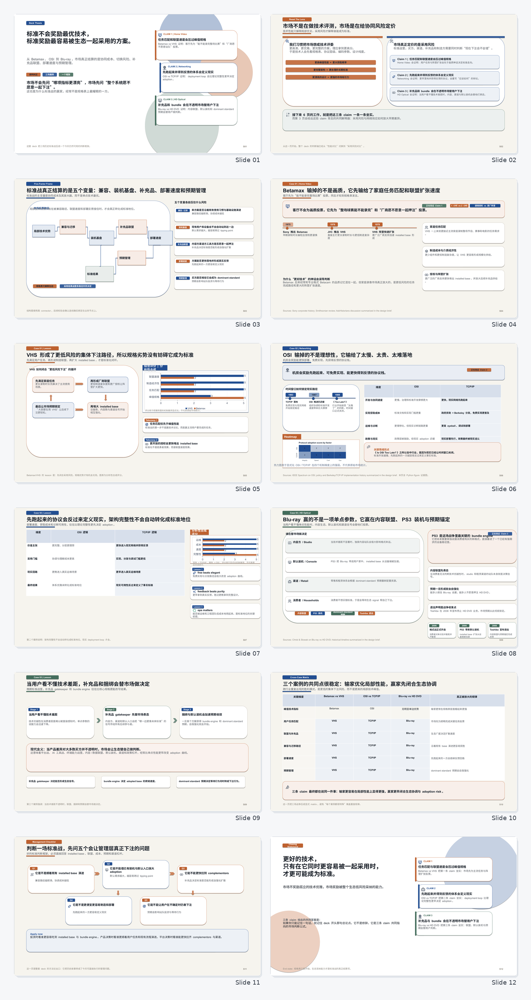

| S01 | S02 |
| --- | --- |
| 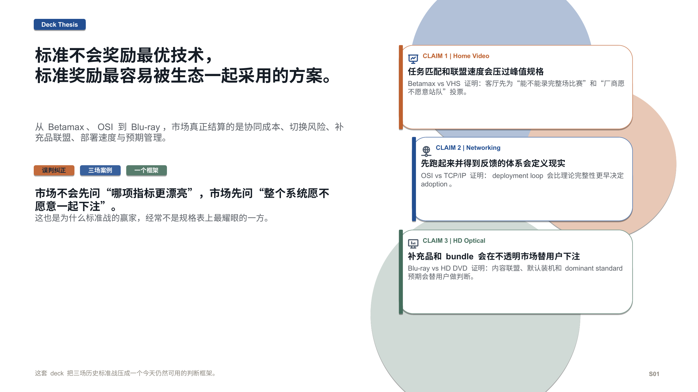 | 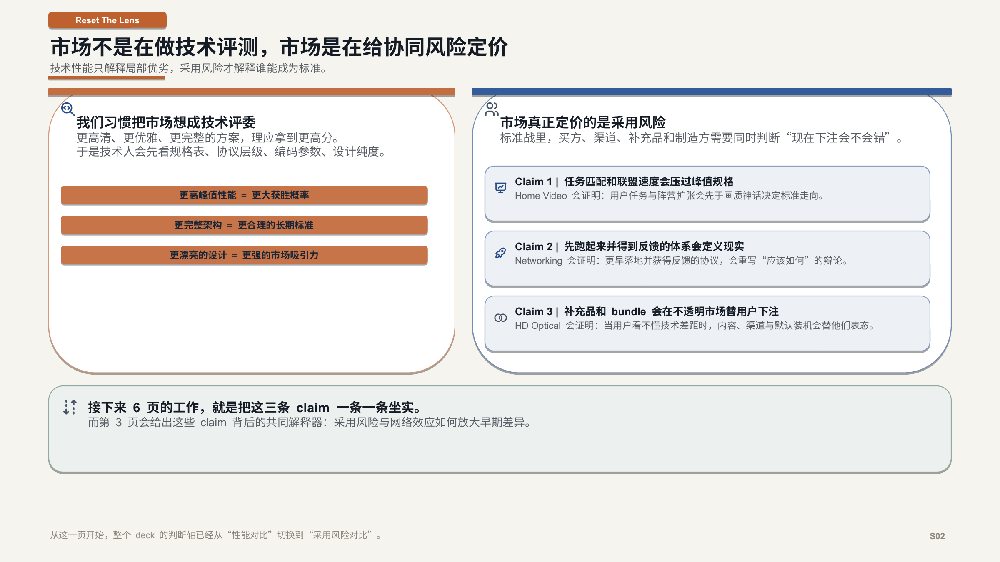 |

| S03 | S04 |
| --- | --- |
| 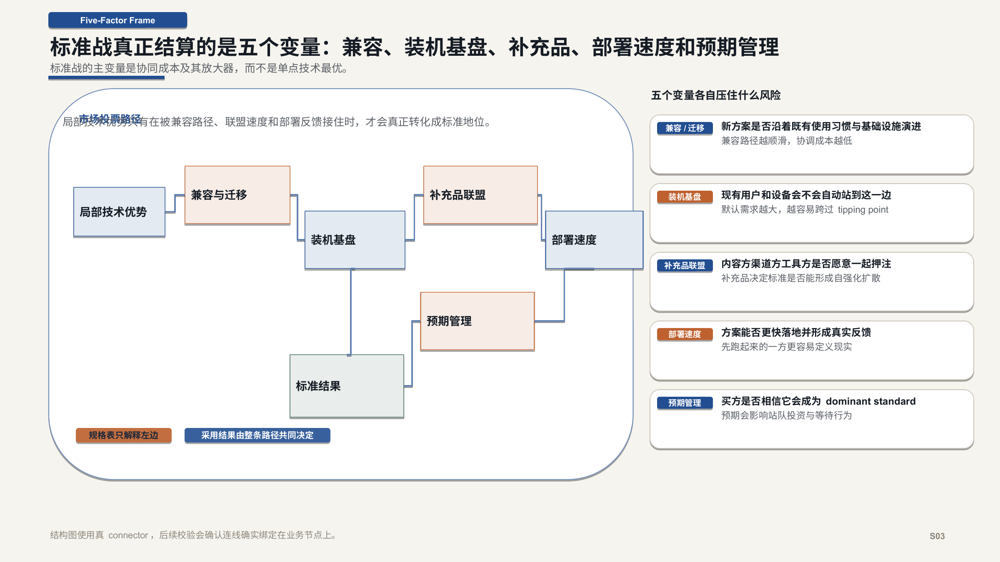 | 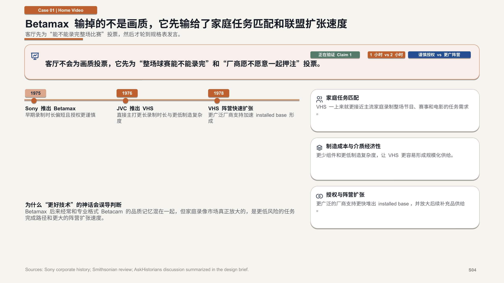 |

| S05 | S06 |
| --- | --- |
| 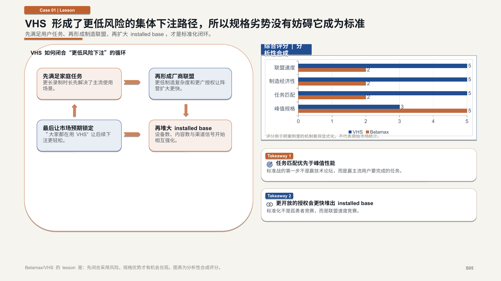 | 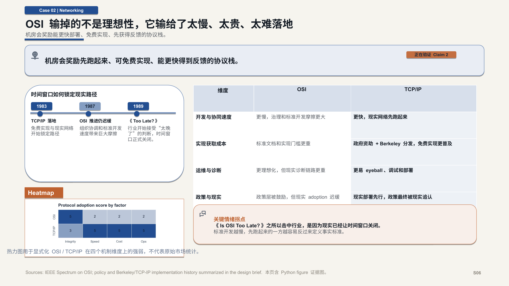 |

| S07 | S08 |
| --- | --- |
| 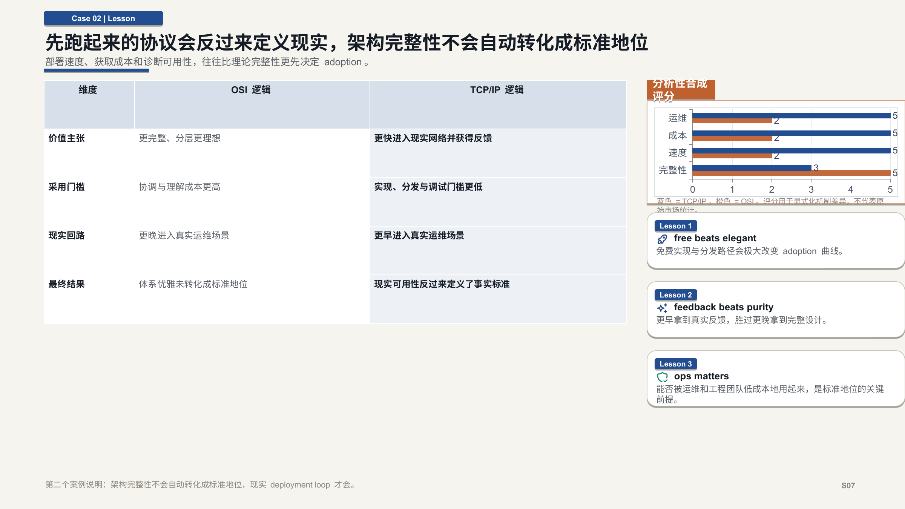 | 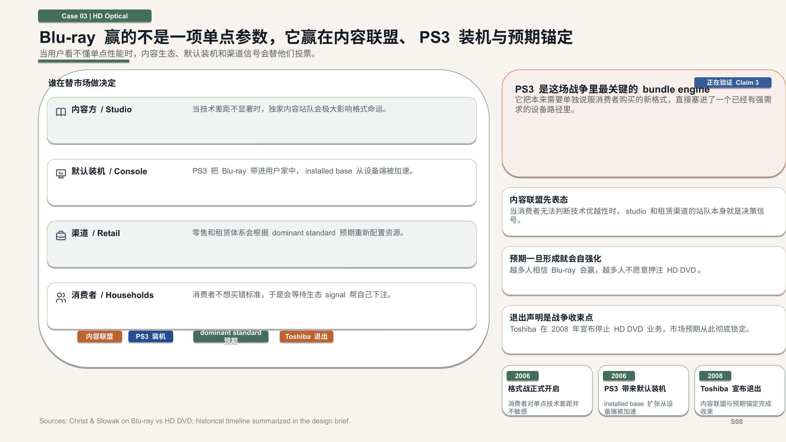 |

| S09 | S10 |
| --- | --- |
| 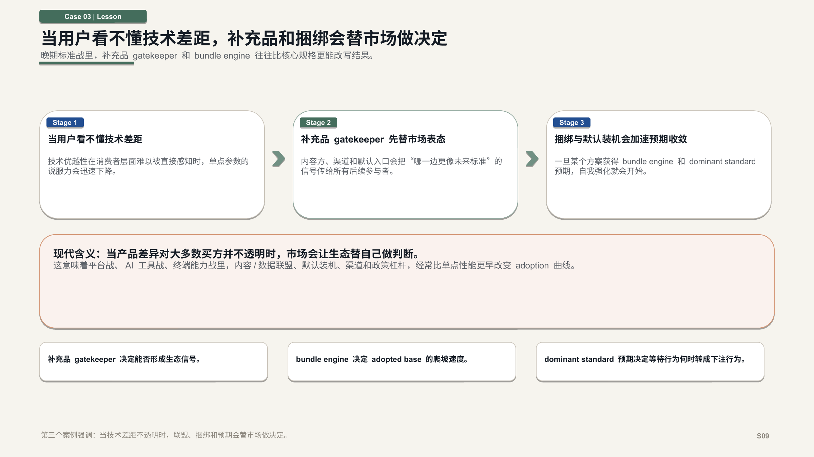 | 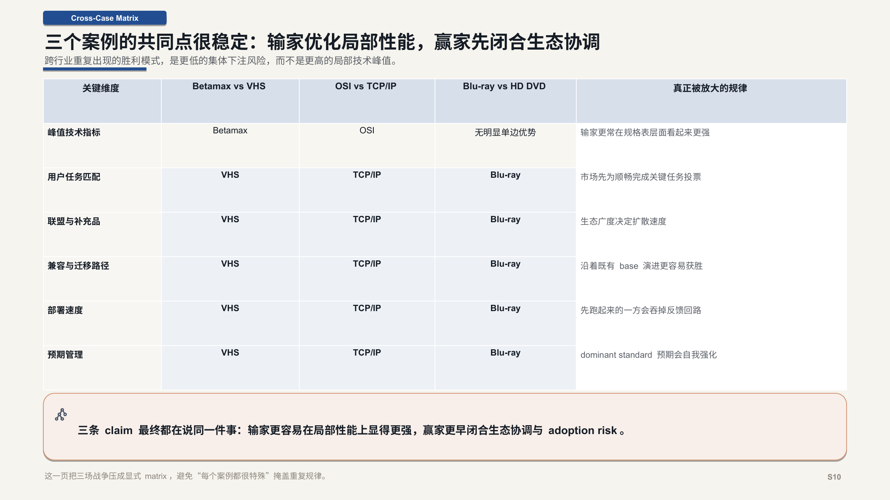 |

| S11 | S12 |
| --- | --- |
| 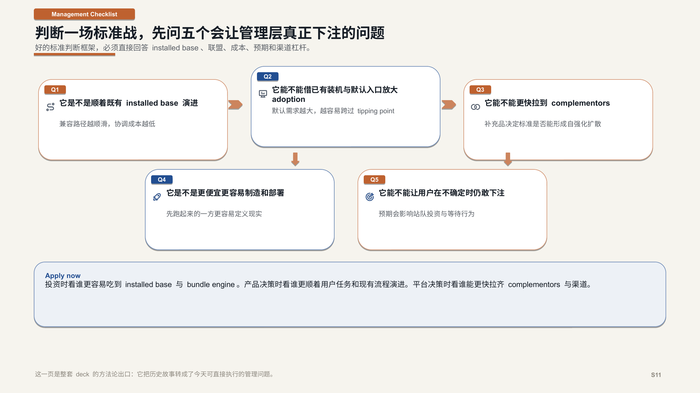 | 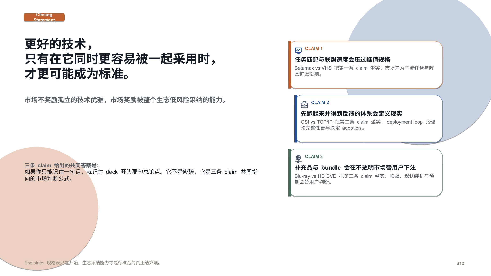 |

## Workspace Structure

```text
old/demos/standard-wars-executive-deck/
  brief.md
  deck_narrative.md
  assets/
  data/
  build/
  validation/
  final/
```

## Quick CLI

Build the deck:

```bash
python old/demos/standard-wars-executive-deck/build/build_deck.py
```

Derive structured slide specs from the narrative source:

```bash
python ppt-polished-deck-collab/scripts/derive_slide_specs_from_narrative.py \
  --narrative old/demos/standard-wars-executive-deck/deck_narrative.md \
  --out-yaml old/demos/standard-wars-executive-deck/build/generated/slide_specs.yaml
```

Lint the workspace:

```bash
python ppt-polished-deck-collab/scripts/lint_deck_assets.py \
  --workspace-dir old/demos/standard-wars-executive-deck
```

Validate the connector page:

```bash
python ppt-polished-deck-collab/scripts/check_pptx_connectors.py \
  --pptx old/demos/standard-wars-executive-deck/build/pptx/standard_wars_executive_deck.pptx \
  --slide 3 \
  --json-out old/demos/standard-wars-executive-deck/validation/structure/connector_report.json \
  --min-connectors 7
```

Export slide previews:

```bash
python ppt-polished-deck-collab/scripts/export_pptx_previews.py \
  --pptx old/demos/standard-wars-executive-deck/build/pptx/standard_wars_executive_deck.pptx \
  --out-dir old/demos/standard-wars-executive-deck/build/rendered/ppt_preview \
  --backend auto \
  --json-out old/demos/standard-wars-executive-deck/validation/manifests/preview_manifest.json
```

## Key Outputs

- Final deck: `final/standard_wars_executive_deck.pptx`
- Build manifest: `validation/manifests/build_manifest.json`
- Preview manifest: `validation/manifests/preview_manifest.json`
- Connector report: `validation/structure/connector_report.json`
- Visual review log: `validation/visual/review_log.md`
- Handoff notes: `final/handoff.md`

## Notes

This demo uses illustrative scoring data to show the chart and figure routes of the skill. Those charts are evidence-design assets, not claims about real market measurements.
