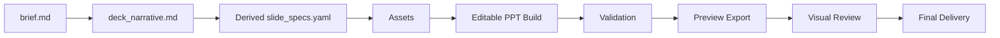

# Deck Workflow

**这份文档的定位。** 本文定义 deck 级工作的主流程、workspace 结构、`brief.md` / `deck_narrative.md` 模板、以及从总叙事文档派生 `slide_specs.yaml` 的默认方式。它是新 skill 最重要的执行文档之一。

## 目录

- 主链路
- Workspace
- `brief.md` 最小模板
- `deck_narrative.md` 最小模板
- 派生 `slide_specs.yaml`
- 字段约定
- 验证模式
- 交付底线

## 什么时候先读它

**只要任务是做一整套 deck，就先读这份文档。** 它回答的问题是“这套材料怎么组织、怎么落 workspace、怎么验证”，比具体页面长相更优先。

## 主链路

**默认主链路固定为：** `brief -> narrative -> derive slide_specs -> assets -> build -> validation -> preview -> review -> final`。



**先锁两份主文档，再 build。** 没有 `brief.md` 和 `deck_narrative.md` 时，不应直接开始生成 PPT。否则全局约束、页面意图与文案想法都会漂。

**`slide_specs.yaml` 默认应派生，不应双写。** 机器执行仍然需要结构化字段，但默认应从 `deck_narrative.md` 生成，而不是要求人类长期维护第三份并行文档。

**先结构验证，再视觉微调。** 如果某页同时有 connector 问题和版式问题，先修结构，再修样式。

## Workspace

**推荐工作空间如下。**

```text
deck_workspace/
  brief.md
  deck_narrative.md
  assets/
    diagrams/
    charts/
    icons/
    images/
    tables/
  build/
    generated/
    pptx/
    rendered/
      ppt_preview/
  validation/
  final/
```

**`brief.md` 放全局任务输入。** 目标读者、使用场景、模板约束、品牌要求、交付标准和验证要求都应在这里固定。它回答的是“为什么做这套 deck”和“哪些约束不能碰”。

**`deck_narrative.md` 放整套叙事与页面想法。** 全局 narrative、核心判断、每页 reader question、文案想法、资产设想和版式意图都在这一份文档里，不再拆成 `deck_plan + content + terminology` 多份平级文档长期双写。

**`build/generated/slide_specs.yaml` 放派生结构化输入。** 它是机器友好的 build 入口，但默认不应手写维护，而应从 `deck_narrative.md` 自动派生。

**`theme_tokens` 应承载 deck 级 typography 与版心策略。** 至少建议显式定义 `body_font_pt`、`latin_font_name`、`east_asia_font_name` 和稳定边距。没有品牌约束时，可默认采用中文黑体、英文 Arial、正文 `14pt` 的策略。

**`assets/` 放源资产。** diagram、chart、icon、image、table 是平级类型。不要让 Mermaid 变成一切页面的默认起点。

**`asset_mode` 是 workflow 的桥接字段。** 设计支持通过它决定页面该用哪类资产，技术支持通过它决定该走哪条实现路线和验证模式。

**`build/` 放可重建产物。** 当前 `pptx`、派生 `slide_specs.yaml`、中间 PDF 和逐页预览图都应放在这里。

**`validation/` 放证据。** connector 报告、preview manifest、review note、asset lint 结果都应集中落在这里。

**`final/` 放交付物。** 给用户和评审会看的最终 deck 与 handoff 说明只放在这里。

## `brief.md` 最小模板

```md
# <Deck Title>

## 任务定义
- 目标读者：
- 主使用场景：
- 目标动作：
- 模板 / 品牌约束：
- 交付物要求：
- 验证要求：

## 风格与边界
- 风格参考：
- 允许使用的素材：
- 不允许发生的错误：
```

## `deck_narrative.md` 最小模板

```md
---
deck:
  title: "<deck title>"
  audience: "<target audience>"
  scenario: "<primary scenario>"
  objective: "<primary decision or action>"
  theme_tokens:
    body_font_pt: 14
    latin_font_name: "Arial"
    east_asia_font_name: "黑体"
    left_margin_in: 0.78
    right_margin_in: 15.22
---

# <Deck Title>

## Global Narrative
- 这套 deck 的主判断：
- 这套 deck 的论证主线：
- 这套 deck 的主题词和禁区：

### S01 | <slide title>
```yaml slide_spec
title: "<slide title>"
reader_question: "<what this page should answer>"
page_task: "persuade"
reading_mode: "decision"
archetype: "decision-logic"
asset_mode: "text-layout-native"
validation_mode: "preview_only"
key_message: "<single core message>"
required_assets: []
```

**Narrative Role.** 这页为什么存在、要帮助读者完成什么判断。

**Content Notes.** 这页准备放什么内容、什么判断句、什么证据。

**Layout Notes.** 这页倾向使用什么版式、什么 icon 或图表策略。
```

## 派生 `slide_specs.yaml`

**默认不要手写维护。** 推荐从 `deck_narrative.md` 派生：

```bash
python scripts/derive_slide_specs_from_narrative.py \
  --narrative <path/to/deck_narrative.md> \
  --out-yaml <path/to/build/generated/slide_specs.yaml>
```

**build 脚本应优先读取派生文件。** 如果派生文件不存在，build 脚本应先生成它，再继续执行。

## 字段约定

**`page_task`。** 推荐使用 `persuade`、`explain`、`compare`、`evidence`、`archive`。

**`reading_mode`。** 推荐使用 `scan`、`decision`、`guided`、`reference`。

**`asset_mode`。** 推荐使用以下显式枚举：
- `text-layout-native`
- `diagram-connector`
- `diagram-visual`
- `office-chart-native`
- `python-figure-image`
- `table-native`
- `image-hero`
- `icon-accent`
- `mixed`

**`validation_mode`。** 推荐使用 `preview_only`、`diagram_connector`、`diagram_visual`、`chart_editable`、`chart_image`、`template_locked`。

**`asset_mode` 和 `validation_mode` 应成对思考。** 例如 `diagram-connector -> diagram_connector`，`office-chart-native -> chart_editable`，`python-figure-image -> chart_image`，而不是 build 完再临时猜测怎么验收。

## 验证模式

**`preview_only`。** 纯文本结构页、摘要页、章节页。要求逐页预览图与人工复核。

**`diagram_connector`。** 后续需要拖动维护的 diagram 页。要求 connector 校验与预览导出。

**`diagram_visual`。** 无 connector 的结构图。要求显式说明不依赖 connector，并检查主方向与层级。

**`chart_editable`。** 原生 Office chart 页。要求确认图表仍可编辑，并检查标签、图例和字体策略。

**`chart_image`。** 高 DPI 图表页。要求检查比例、清晰度与卡片内留白。

**`template_locked`。** 强模板页。要求确认关键品牌元素未漂移，并通过预览做高保真复核。

## 交付底线

**完整交付至少包含六项。** `brief.md`、`deck_narrative.md`、派生 `slide_specs.yaml`、可编辑 `pptx`、逐页预览图、与页面验证模式相匹配的验证结果。

**每次修改都要有新证据。** 修复后必须能指出新的 `pptx`、新的 preview，或新的结构校验结果。
