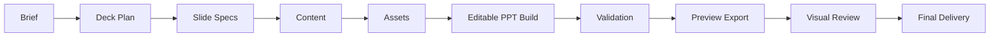

# Deck Workflow

**这份文档的定位。** 本文定义 deck 级工作的主流程、workspace 结构、`deck_plan` 模板和验证证据要求。它是新 skill 最重要的执行文档之一。

## 目录

- 主链路
- Workspace
- `deck_plan.md` 最小模板
- `slide_specs.yaml` 最小模板
- 字段约定
- 验证模式
- 交付底线

## 什么时候先读它

**只要任务是做一整套 deck，就先读这份文档。** 它回答的问题是“这套材料怎么组织、怎么落 workspace、怎么验证”，比具体页面长相更优先。

## 主链路

**默认主链路固定为：** `brief -> plan -> content -> assets -> build -> validation -> preview -> review -> final`。



**先 plan，后 build。** 没有 `deck_plan` 和 `slide_specs` 时，不应直接开始生成 PPT。否则 archetype、资产模式和验证模式都会漂。

**先结构验证，再视觉微调。** 如果某页同时有 connector 问题和版式问题，先修结构，再修样式。

## Workspace

**推荐工作空间如下。**

```text
deck_workspace/
  brief/
  plan/
  content/
  assets/
    diagrams/
    charts/
    icons/
    images/
    tables/
  build/
    pptx/
    rendered/
      ppt_preview/
  validation/
  final/
```

**`brief/` 放任务输入。** 目标读者、使用场景、模板约束、品牌要求、页数范围都应在这里固定。

**`plan/` 放页面主键。** `deck_plan.md` 和 `slide_specs.yaml` 是整个 deck 的结构中心，后续 build 与 validation 都应从这里出发。

**`content/` 放叙事。** narrative、关键判断、术语映射、bullet 素材都应单独落盘，不要散在脚本注释里。

**`assets/` 放源资产。** diagram、chart、icon、image、table 是平级类型。不要让 Mermaid 变成一切页面的默认起点。

**`asset_mode` 是 workflow 的桥接字段。** 设计支持通过它决定页面该用哪类资产，技术支持通过它决定该走哪条实现路线和验证模式。

**`build/` 放可重建产物。** 当前 `pptx`、中间 PDF、逐页预览图都应放在这里。

**`validation/` 放证据。** connector 报告、preview manifest、review note、asset lint 结果都应集中落在这里。

**`final/` 放交付物。** 给用户和评审会看的最终 deck 与 handoff 说明只放在这里。

## `deck_plan.md` 最小模板

```md
# <Deck Title>

## 任务定义
- 目标读者：
- 主使用场景：
- 目标动作：
- 页数预期：
- 模板 / 品牌约束：

## 整体结论
- 这套 deck 最想让读者记住的 1~3 个判断：

## 页面清单
| Slide | 暂定标题 | Reader Question | Page Task | Reading Mode | Archetype | Asset Mode | Validation Mode |
| --- | --- | --- | --- | --- | --- | --- | --- |
| S01 |  |  |  |  |  |  |  |
| S02 |  |  |  |  |  |  |  |
```

## `slide_specs.yaml` 最小模板

```yaml
deck:
  title: "<deck title>"
  audience: "<target audience>"
  scenario: "<primary scenario>"

slides:
  - slide_id: "S01"
    title: "<slide title>"
    reader_question: "<what this page should answer>"
    page_task: "persuade"
    reading_mode: "decision"
    archetype: "decision-logic"
    asset_mode: "text-layout-native"
    validation_mode: "preview_only"
    key_message: "<single core message>"
    required_assets: []
```

## 字段约定

**`page_task`。** 推荐使用 `persuade`、`explain`、`compare`、`evidence`、`archive`。

**`reading_mode`。** 推荐使用 `scan`、`decision`、`guided`、`reference`。

**`asset_mode`。** 推荐使用以下显式枚举：
- `text-layout-native`
- `diagram-connector`
- `diagram-visual`
- `office-chart-native`
- `python-figure-image`
- `table-native`
- `image-hero`
- `icon-accent`
- `mixed`

**`validation_mode`。** 推荐使用 `preview_only`、`diagram_connector`、`diagram_visual`、`chart_editable`、`chart_image`、`template_locked`。

**`asset_mode` 和 `validation_mode` 应成对思考。** 例如 `diagram-connector -> diagram_connector`，`office-chart-native -> chart_editable`，`python-figure-image -> chart_image`，而不是 build 完再临时猜测怎么验收。

## 验证模式

**`preview_only`。** 纯文本结构页、摘要页、章节页。要求逐页预览图与人工复核。

**`diagram_connector`。** 后续需要拖动维护的 diagram 页。要求 connector 校验与预览导出。

**`diagram_visual`。** 无 connector 的结构图。要求显式说明不依赖 connector，并检查主方向与层级。

**`chart_editable`。** 原生 Office chart 页。要求确认图表仍可编辑，并检查标签和图例。

**`chart_image`。** 高 DPI 图表页。要求检查比例、清晰度与卡片内留白。

**`template_locked`。** 强模板页。要求确认关键品牌元素未漂移，并通过预览做高保真复核。

## 交付底线

**完整交付至少包含四项。** `deck_plan`、可编辑 `pptx`、逐页预览图、与页面验证模式相匹配的验证结果。

**每次修改都要有新证据。** 修复后必须能指出新的 `pptx`、新的 preview，或新的结构校验结果。
