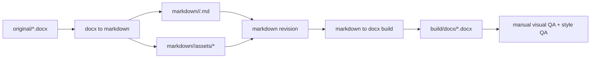

# Document Workflow

**这份文档的定位。** 本文定义 `word-polished-doc-collab` 的默认 workspace 结构、`docx <-> markdown <-> docx` 的协作流程，以及表题、图题、表注在 Markdown 中的稳定语义约定。

## 推荐 workspace

**工作区应该把“来源、编辑、构建、验证”分开。** 推荐结构如下：

```text
doc-workspace/
├── original/
├── markdown/
│   └── <doc-slug>/
│       ├── <doc-slug>.md
│       ├── assets/
│       └── meta.json
├── build/
│   └── docx/
├── scripts/
└── temp/
```

## 数据流



## 默认工作流

**第一步是锁 source of truth。** 新收到的外部 Word 文档先归档到 `original/`。如果当前文档已经在 Markdown 里人工持续维护，就不要反复用原件覆盖它。

**第二步是保留 Word 的结构语义。** 抽取到 Markdown 时优先保留标题、正文、列表、表格和图片顺序。不要为了“导出更快”就把表格改成截图或把图片说明揉进上一段正文。

**第三步是只在 Markdown 里做持续编辑。** 文本修改、结构调整、表题表注补齐、图片替换都优先在 Markdown 层完成。导出的 `.docx` 是交付物，不是长期维护源。

**第四步是把版式映射放在构建器。** 统一字体、字号、行距、段前段后、表图标题位置和表格密度都应在构建阶段集中设置，而不是由作者手工在 Markdown 中模拟。

**第五步是导出后强制复核。** 至少复核标题层级、表格宽度、图片缩放、分页和字体槽位。没有复核的导出物不算完成。

## Markdown 语义约定

**标题和正文使用标准 Markdown。** `#` 到 `###` 对应主要标题层级，普通段落对应正文，`-` 和 `1.` 对应列表，pipe table 对应表格。

**表题使用单独段落并位于表上方。** 推荐写法：

```md
表题：表 1 费用分摊明细

| 项目 | 金额 |
| --- | ---: |
| 管理费 | 100 |
| 托管费 | 20 |
```

**表注使用单独段落并位于表下方。** 推荐写法：

```md
表注：金额单位为人民币万元，数据截至 2026-04-29。
```

**图题使用单独段落并位于图片下方。** 推荐写法：

```md


图题：图 1 费用审批流程
```

**图表资产要相对引用。** 图片、Python figure 和未来的导出图都应放在文档目录的 `assets/` 下，并通过相对路径引用，保证工作区可搬运。

## `meta.json` 的职责

**`meta.json` 负责绑定来源和输出。** 推荐至少保存：
- `source_docx`
- `markdown_file`
- `assets_dir`
- `output_docx`
- `style_profile`

**`style_profile` 应该进入元数据。** 这样构建脚本才能知道这份文档默认用 `cn_song_times`、`cn_kaiti_times` 还是 `cn_heiti_arial`。

## 适合自动化的部分

**结构抽取适合自动化。** 段落、标题、表格、图片、元数据的抽取与回写，适合脚本处理。

**版式映射适合自动化。** 正文字号、标题梯度、表格密度、caption 位置和字体槽位，适合统一写在构建器里。

**最终视觉判断仍需要人工。** 页尾孤行、超宽表格、图片模糊、分页位置和法务类特殊格式，仍应人工复核。
